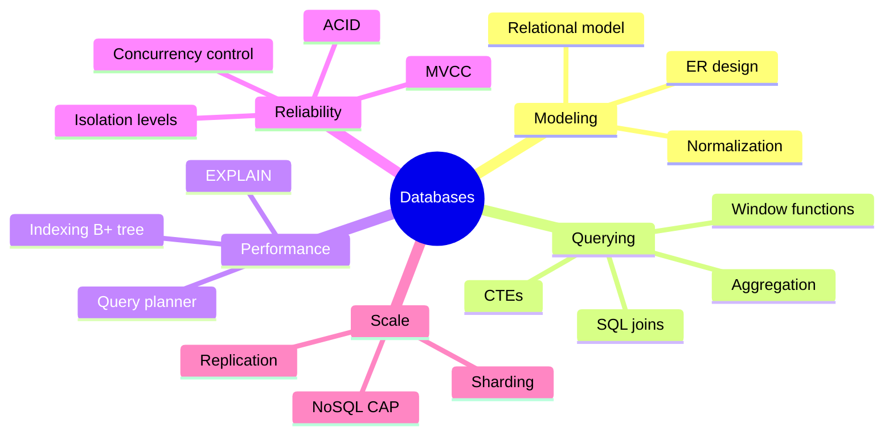
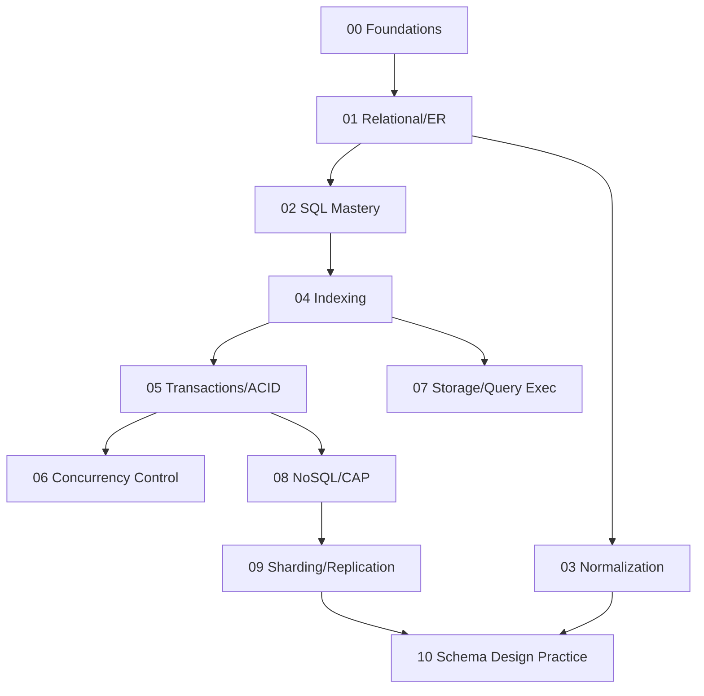

# Database — Learning Plan (Full Syllabus)

> **Visual learner**: har module `## Visual map`. Start: `@VISUAL-STUDY-GUIDE.md`.
> **No standard topic left out.** SQL modules (02, 10) heavily query-practice based.

## Mind map

## Dependency graph

---

## Module 00 — Foundations
**Topics**: DBMS vs file system; data models (relational, document, KV, graph); 3-schema architecture (external/conceptual/internal); data independence; DDL/DML/DCL/TCL; keys (super, candidate, primary, foreign, composite, surrogate vs natural); constraints (NOT NULL, UNIQUE, CHECK, FK actions).
**Exit**: keys explain with example; why FK + ON DELETE CASCADE matters; 3-schema architecture diagram.

## Module 01 — Relational Model & ER Design
**Topics**: Relation/tuple/attribute/domain; relational algebra (σ select, π project, ⋈ join, ∪, −, ×); ER model (entity, attribute, relationship); cardinality (1:1, 1:N, M:N); weak entities; ER → relational schema mapping; generalization/specialization.
**Assignments**: A1 model a domain (e.g. payments: users, accounts, transactions) as ER → schema; A2 write 5 relational-algebra expressions for given queries.
**Exit**: ER → schema mapping rules; M:N → junction table; relational algebra basics.

## Module 02 — SQL Mastery 🔥
**Topics**: SELECT/WHERE/ORDER/LIMIT; all JOINs (INNER, LEFT/RIGHT/FULL OUTER, CROSS, SELF); GROUP BY + HAVING; aggregates; subqueries (scalar, correlated, EXISTS/IN); CTEs (WITH, recursive); **window functions** (ROW_NUMBER, RANK, DENSE_RANK, LAG/LEAD, running totals, PARTITION BY); CASE; set ops (UNION/INTERSECT/EXCEPT); NULL handling; INSERT/UPDATE/DELETE/UPSERT; views.
**Assignments (SQL — khud likho, run karo)**: A1 join + aggregation report; A2 2nd-highest salary (3 ways); A3 running total + rank per group (window); A4 recursive CTE (org hierarchy / category tree); A5 find duplicates + delete keeping one; A6 gaps-and-islands.
**Exit**: 2nd-highest 3 ways; window vs GROUP BY difference; correlated subquery explain; recursive CTE.

## Module 03 — Normalization
**Topics**: Functional dependencies; Armstrong's axioms; closure; candidate key from FDs; 1NF, 2NF (partial dep), 3NF (transitive dep), BCNF; 4NF/5NF (overview); denormalization (when + why); anomalies (insert/update/delete).
**Assignments**: A1 given FDs find candidate keys + highest normal form; A2 decompose to 3NF/BCNF (lossless, dependency-preserving).
**Exit**: 2NF vs 3NF vs BCNF with example; when denormalize; 3 anomalies.

## Module 04 — Indexing
**Topics**: Why indexes; B-tree vs **B+ tree** (why B+ for DB); clustered vs non-clustered (heap); primary vs secondary; composite index + **leftmost prefix rule**; covering index; hash index; bitmap index; full-text/GIN; index on expression; when index HURTS (writes, low cardinality); `EXPLAIN` index usage.
**Assignments**: A1 design indexes for a slow query, justify; A2 leftmost-prefix puzzle (which queries use composite (a,b,c)?).
**Exit**: B+ tree vs B-tree; clustered vs non-clustered; leftmost prefix; covering index; index write cost.

## Module 05 — Transactions & ACID
**Topics**: ACID (atomicity, consistency, isolation, durability); transaction states; **isolation levels** (read uncommitted, read committed, repeatable read, serializable); anomalies (dirty read, non-repeatable read, phantom, lost update, write skew); **MVCC** (snapshot isolation, Postgres tuple versions, vacuum); WAL + durability; savepoints (CV hook).
**Assignments**: A1 reproduce each anomaly with 2 sessions at different isolation levels; A2 reason about a money-transfer txn under each level.
**Exit**: 4 isolation levels ↔ which anomaly allowed (the table from memory); MVCC explain; phantom vs non-repeatable read.

## Module 06 — Concurrency Control
**Topics**: Lock-based (shared/exclusive); lock granularity (row/page/table); **2-phase locking** (2PL, strict 2PL); deadlock in DB (detection, victim, wait-for graph); optimistic concurrency control; timestamp ordering; serializability (conflict, view); `SELECT ... FOR UPDATE`; gap locks.
**Assignments**: A1 show a deadlock with 2 sessions + how DB resolves; A2 pessimistic vs optimistic for inventory decrement.
**Exit**: 2PL guarantees serializability — kaise; optimistic vs pessimistic — kab; deadlock victim selection.

## Module 07 — Storage & Query Execution
**Topics**: Row vs column store; pages/heap/tuples; buffer pool; **query execution**: parse → optimize → execute; `EXPLAIN`/`EXPLAIN ANALYZE`; **join algorithms** (nested loop, hash join, merge join — when each); sort (external); cardinality estimation + statistics; query cost; sequential vs index scan; N+1 query problem.
**Assignments**: A1 read an `EXPLAIN ANALYZE`, find the slow node, propose fix; A2 force seq-scan vs index-scan, compare.
**Exit**: 3 join algorithms + when planner picks each; why a query went seq-scan; N+1 problem + fix.

## Module 08 — NoSQL & CAP
**Topics**: Why NoSQL; types (KV: Redis/DynamoDB, document: Mongo, wide-column: Cassandra, graph: Neo4j); **CAP theorem** + PACELC; BASE vs ACID; eventual consistency; consistency levels (quorum: R+W>N); when SQL vs NoSQL; data modeling in NoSQL (denormalize, access-pattern-first).
**Assignments**: A1 model a feed/cart in both SQL and a document store, compare; A2 pick CP vs AP for 3 scenarios + justify.
**Exit**: CAP — partition pe C vs A choose; quorum R+W>N; SQL vs NoSQL decision; PACELC.

## Module 09 — Sharding & Replication
**Topics**: Vertical vs horizontal partitioning; **sharding** strategies (range, hash, directory, consistent hashing); hot shards; resharding; **replication** (sync vs async, leader-follower, multi-leader, leaderless); read replicas + replication lag; failover; partitioning + secondary indexes; CDC.
**Assignments**: A1 choose a shard key for a multi-tenant app, defend; A2 reason about read-after-write consistency with async replicas.
**Exit**: sharding strategies + hot-shard problem; sync vs async replication trade-off; replication lag handling.

## Module 10 — Schema Design Practice 🔥
**Topics**: End-to-end schema design problems; indexing + normalization decisions; a curated **SQL problem bank** (LeetCode-DB style). Problems: design schema for — (1) e-commerce orders, (2) social feed + followers, (3) ride-hailing, (4) URL shortener analytics, (5) banking ledger (CV anchor), (6) multi-tenant SaaS metering. SQL drills: top-N per group, median, sessionization, funnel, cohort retention, pivot.
**Assignments**: pick 3 design problems → ER + schema + indexes + 5 representative queries each.
**Exit**: defend a schema end-to-end in interview; write any top-N-per-group + window query confidently.

---

## Weekly rhythm
| Day | Focus |
|-----|-------|
| Mon–Tue | Concept + recall |
| Wed–Thu | SQL/sim assignment (run it) |
| Fri | Interview twists + NOTES |
| Sat | Spaced recall bina notes |
| Sun | Buffer |

## Spaced repetition checklist (har 2 modules)
- [ ] Isolation levels ↔ anomalies table
- [ ] B+ tree vs B-tree + leftmost prefix
- [ ] 2nd-highest salary 3 ways
- [ ] CAP partition decision
- [ ] 3 join algorithms when
- [ ] Normalize to BCNF example
