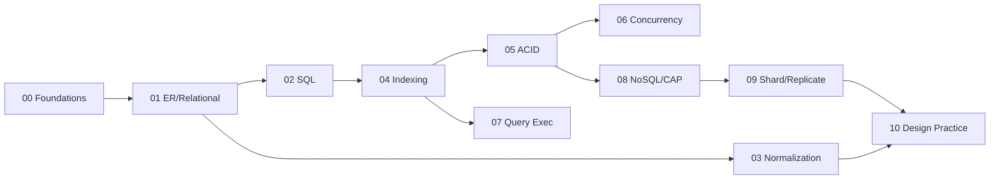

# DB Visual Study Guide — Vansh

> Visual learner master sheet. Diagrams pehle, redraw se recall.

## Full journey


## Isolation levels ↔ anomalies (MEMORIZE)
```
Level             | Dirty read | Non-repeat | Phantom
------------------|-----------|-----------|--------
Read Uncommitted  |   YES     |   YES     |  YES
Read Committed    |   no      |   YES     |  YES
Repeatable Read   |   no      |   no      |  YES*  (*MVCC may prevent)
Serializable      |   no      |   no      |  no
```

## B+ tree (why DBs love it)
```
           [ 30 | 60 ]                 internal: keys only, route
          /     |     \
   [10 20]   [40 50]   [70 80]         leaves: all data, LINKED →→
   leaf ──► leaf ──► leaf              range scan = walk leaf chain
B+ vs B-tree: B+ keeps data only in leaves + linked leaves → range queries fast
```

## Leftmost prefix rule
```
INDEX (a, b, c)  helps:
  WHERE a=?            ✓
  WHERE a=? AND b=?    ✓
  WHERE a=? AND b=? AND c=?  ✓
  WHERE b=?           ✗ (skips a)
  WHERE a=? AND c=?    partial (only a)
```

## Join algorithms
```
Nested Loop : small × indexed     (for each outer row, probe inner)
Hash Join   : large, equi-join, no order   (build hash on one side)
Merge Join  : both inputs sorted on join key
```

## CAP
```
        Consistency
           /\
          /  \      Partition happens (P given):
   Pick  /    \  Pick   CP = refuse/wait (consistent)
   one  /      \ one    AP = serve stale (available)
   Availability--Partition
```

## CV → DB bridge
```
Reconciliation/matching ──► Joins, indexing
Ledger consistency      ──► ACID, isolation, MVCC
Outbox exactly-once     ──► Transactions, idempotency
Multi-tenant isolation  ──► Partitioning, sharding
Connection pool         ──► Locks, deadlock
```

## Spaced-rep recall bank
1. Repeatable Read kaunsa anomaly allow karta?
2. Index write ko slow kyun karta?
3. Hash join kab merge join se accha?
4. R+W>N quorum kya guarantee deta?
5. Denormalize kab karna chahiye?
6. Phantom vs non-repeatable read?
