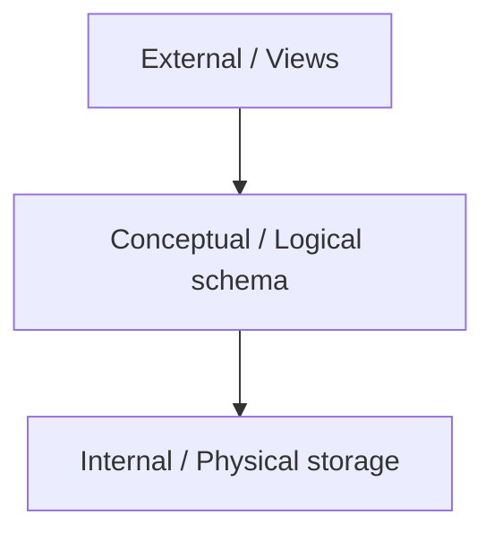

# Module 00 — DB Foundations

> **Agent spawn**: `@Memory.md` + `@Prompt.md` + this file + `@NOTES.md`
> **Nav**: Next → [01 Relational & ER](../01-relational-model-er/MODULE.md)

## At a glance
| | |
|---|---|
| Prerequisites | None |
| Duration | ~1 session |
| Exit test | Keys types + 3-schema architecture |

## Visual map

```
KEYS:
  super key      : koi bhi attribute-set jo row unique kare
  candidate key  : minimal super key
  primary key    : chosen candidate (NOT NULL, unique)
  foreign key    : doosri table ke PK ko point
  surrogate (id) vs natural (email) key
```
**Mental model**: DBMS = structured data + concurrent access + ACID + querying, file system se kahin zyada. 3-schema = data independence (storage badlo, queries na toote).

**Redraw challenge**: 3-schema architecture + keys hierarchy (super→candidate→primary).

## Objectives
1. DBMS vs file system; data models
2. 3-schema architecture + data independence
3. SQL sub-languages (DDL/DML/DCL/TCL)
4. Keys + constraints

## Topics
- Why DBMS (concurrency, integrity, recovery, querying)
- Data models: relational, document, KV, graph
- 3-schema architecture; logical/physical independence
- DDL/DML/DCL/TCL
- Keys: super/candidate/primary/foreign/composite; surrogate vs natural
- Constraints: NOT NULL, UNIQUE, CHECK, FK + ON DELETE/UPDATE actions

## Assignments
| # | Task | Passing criteria |
|---|------|------------------|
| A1 | For a sample table, list all candidate keys + pick PK | Correct + justified |
| A2 | Add FK with ON DELETE CASCADE, test cascade | Child rows deleted correctly |

## Active recall bank
1. Candidate vs super key — minimality?
2. Surrogate key kab natural se behtar?
3. Data independence kya, 3-schema kaise deta?

## Progress checklist
- [ ] Keys + 3-schema from memory
- [ ] A1, A2 done
- [ ] NOTES.md updated
