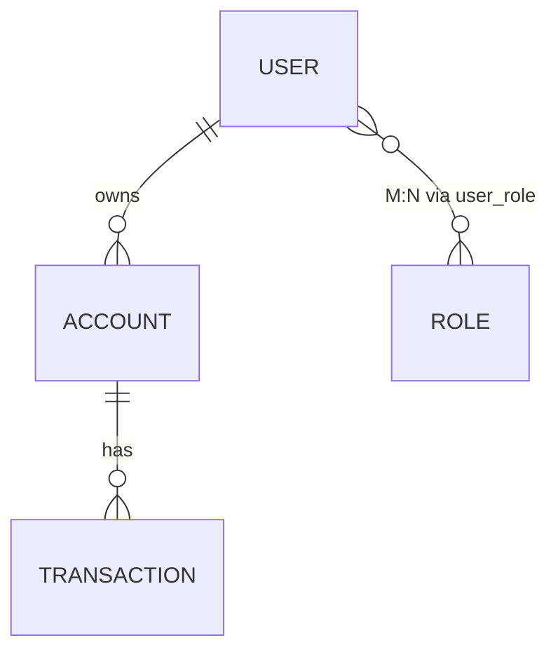

# Module 01 — Relational Model & ER Design

> **Agent spawn**: `@Memory.md` + `@Prompt.md` + this file + `@NOTES.md`
> **Nav**: ← [00 Foundations](../00-foundations/MODULE.md) · Next → [02 SQL Mastery](../02-sql-mastery/MODULE.md)

## At a glance
| | |
|---|---|
| Prerequisites | 00 |
| Duration | ~1 session |
| Exit test | ER → schema mapping + M:N junction |

## Visual map

```
Cardinality:
  1:1   user — profile
  1:N   account — transactions
  M:N   users — roles   → junction table (user_id, role_id)
Relational algebra: σ(select) π(project) ⋈(join) ∪ − ×
```
**Mental model**: ER = real-world ko entities + relationships mein todna. M:N hamesha junction table banata hai. SQL = relational algebra ka practical roop.

**Redraw challenge**: ER for payments domain (user/account/transaction) + M:N junction.

## Objectives
1. Relation/tuple/attribute/domain
2. Relational algebra core operators
3. ER model + cardinality + weak entities
4. ER → relational schema mapping

## Topics
- Relation, tuple, attribute, domain, degree, cardinality
- Relational algebra: σ, π, ⋈ (theta/equi/natural), ∪, −, ×, ÷
- ER: entities, attributes (simple/composite/multivalued/derived), relationships
- Cardinality 1:1/1:N/M:N; participation; weak entities
- ER → schema: M:N → junction; weak entity → composite key
- Generalization / specialization

## Assignments
| # | Task | Passing criteria |
|---|------|------------------|
| A1 | ER + schema for payments domain (users/accounts/txns) | All cardinalities correct, M:N as junction |
| A2 | Write 5 relational-algebra expressions for given queries | Correct operators |

## Active recall bank
1. M:N kaise map hota relational mein?
2. Weak entity ka key kaise banta?
3. Natural join vs theta join?

## Progress checklist
- [ ] ER → schema rules from memory
- [ ] A1, A2 done
- [ ] NOTES.md updated
