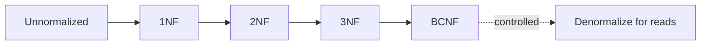

# Module 03 — Normalization

> **Agent spawn**: `@Memory.md` + `@Prompt.md` + this file + `@NOTES.md`
> **Nav**: ← [02 SQL Mastery](../02-sql-mastery/MODULE.md) · Next → [04 Indexing](../04-indexing/MODULE.md)

## At a glance
| | |
|---|---|
| Prerequisites | 01 |
| Duration | ~1–2 sessions |
| Exit test | FDs → candidate key + decompose to BCNF |

## Visual map
```
1NF : atomic values, no repeating groups
2NF : 1NF + no PARTIAL dependency (non-key on part of composite key)
3NF : 2NF + no TRANSITIVE dependency (non-key → non-key)
BCNF: every determinant is a candidate key
```

**Mental model**: Normalization = redundancy hatao, anomalies roko, ek fact ek jagah. Higher NF = less redundancy par zyada joins. Denormalization = reads tez karne ke liye soch-samajh ke redundancy waapas.

**Redraw challenge**: 1NF→BCNF ladder + what each removes.

## Objectives
1. Functional dependencies + closure + candidate key
2. 1NF/2NF/3NF/BCNF + anomalies
3. Lossless + dependency-preserving decomposition
4. When to denormalize

## Topics
- FDs; Armstrong's axioms; attribute closure; candidate key from FDs
- Anomalies: insert/update/delete
- 1NF, 2NF (partial dep), 3NF (transitive dep), BCNF (determinant = key)
- 4NF (multivalued dep), 5NF overview
- Lossless join + dependency preservation
- Denormalization trade-off

## Assignments
| # | Task | Passing criteria |
|---|------|------------------|
| A1 | Given FDs → find candidate keys + highest NF | Correct keys + NF justification |
| A2 | Decompose a table to 3NF/BCNF | Lossless + dependency-preserving (or note the trade-off) |

## Active recall bank
1. 2NF vs 3NF — partial vs transitive?
2. BCNF mein 3NF se kya extra?
3. Denormalize kab justified?

## Progress checklist
- [ ] FD closure + NF ladder from memory
- [ ] A1, A2 done
- [ ] NOTES.md updated
