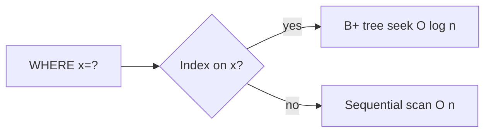

# Module 04 — Indexing

> **Agent spawn**: `@Memory.md` + `@Prompt.md` + this file + `@NOTES.md`
> **Nav**: ← [03 Normalization](../03-normalization/MODULE.md) · Next → [05 Transactions & ACID](../05-transactions-acid/MODULE.md)

## At a glance
| | |
|---|---|
| Prerequisites | 02 |
| Duration | ~1–2 sessions |
| Exit test | B+ vs B-tree + leftmost prefix + covering index |

## Visual map
```
           [ 30 | 60 ]              internal nodes = routing keys
          /     |     \
   [10 20]→[40 50]→[70 80 90]       leaves = data, LINKED for range scans
B+ tree: O(log n) lookup, leaf-chain = fast range queries

Composite INDEX(a,b,c) — leftmost prefix:
   a=? ✓   a,b=? ✓   a,b,c=? ✓   b=? ✗   a,c=? partial
```

**Mental model**: Index = book ka index — direct page pe jao, poori book mat padho. Read fast, par har write ko index bhi update karna padta (write cost). Covering index = query poori index se ban jaye, table touch hi na ho.

**Redraw challenge**: B+ tree with linked leaves + leftmost prefix table.

## Objectives
1. B-tree vs B+ tree; clustered vs non-clustered
2. Composite index + leftmost prefix; covering index
3. Hash/bitmap/GIN; when index hurts
4. Reading index usage in EXPLAIN

## Topics
- Why indexes; B-tree vs B+ tree (why B+ for ranges)
- Clustered (data ordered) vs non-clustered (heap + pointer)
- Primary vs secondary; composite + leftmost prefix; covering index
- Hash index (equality only), bitmap (low cardinality), GIN/full-text
- When index HURTS: write-heavy, low cardinality, small tables
- `EXPLAIN` — seq scan vs index scan vs index-only scan

## Assignments
| # | Task | Passing criteria |
|---|------|------------------|
| A1 | A slow query → design index(es) + justify with EXPLAIN | Query goes index scan, faster, justified |
| A2 | Leftmost-prefix puzzle on INDEX(a,b,c) | Correctly say which of 6 queries use it |

## Active recall bank
1. B+ tree DB ke liye B-tree se behtar kyun?
2. Covering index kya bachata?
3. Index write ko slow kyun karta?
4. Low-cardinality column pe B-tree useless kyun?

## Progress checklist
- [ ] B+ tree + leftmost prefix from memory
- [ ] A1, A2 done
- [ ] NOTES.md updated
