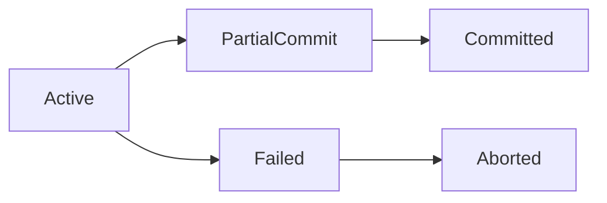

# Module 05 — Transactions & ACID

> **Agent spawn**: `@Memory.md` + `@Prompt.md` + this file + `@NOTES.md`
> **Nav**: ← [04 Indexing](../04-indexing/MODULE.md) · Next → [06 Concurrency Control](../06-concurrency-control/MODULE.md)

## At a glance
| | |
|---|---|
| Prerequisites | 04 |
| Duration | ~2 sessions |
| Exit test | Isolation↔anomalies table + MVCC |

## Visual map
```
ACID:
  Atomicity   all-or-nothing (rollback)
  Consistency valid → valid (constraints)
  Isolation   concurrent txns feel alone
  Durability  commit = survives crash (WAL)

Isolation level | Dirty | Non-repeat | Phantom
Read Uncommitted|  Y    |    Y       |   Y
Read Committed  |  n    |    Y       |   Y
Repeatable Read |  n    |    n       |   Y*
Serializable    |  n    |    n       |   n
```

**Mental model**: Transaction = ek logical unit, beech mein crash ho toh poora rollback (atomicity). Isolation level = "doosre txns ka kitna gandapan dikhe". MVCC = har row ke versions rakho, readers ko purana snapshot do — readers writers ko block nahi karte.

**Redraw challenge**: Isolation↔anomalies table (bina dekhe) + txn state diagram.

## Objectives
1. ACID properties precisely
2. Isolation levels ↔ anomalies
3. MVCC / snapshot isolation
4. WAL + durability; savepoints

## Topics
- ACID; transaction states
- Anomalies: dirty read, non-repeatable read, phantom, lost update, write skew
- Isolation levels: RU/RC/RR/Serializable
- MVCC: tuple versions, snapshot, vacuum (Postgres)
- WAL → durability; checkpoints; savepoints (CV hook: refund chain savepoints)

## Assignments
| # | Task | Passing criteria |
|---|------|------------------|
| A1 | Reproduce dirty/non-repeatable/phantom with 2 sessions | Each anomaly shown at the right level |
| A2 | Money transfer txn — reason behaviour per isolation level | Correct anomaly analysis |

## Active recall bank
1. Repeatable Read phantom allow karta — kyun?
2. MVCC readers/writers ko block kyun nahi karta?
3. Durability WAL se kaise aata?
4. Write skew kya, kaunsa level rokta?

## Progress checklist
- [ ] Isolation↔anomalies table from memory
- [ ] A1, A2 done
- [ ] NOTES.md updated
