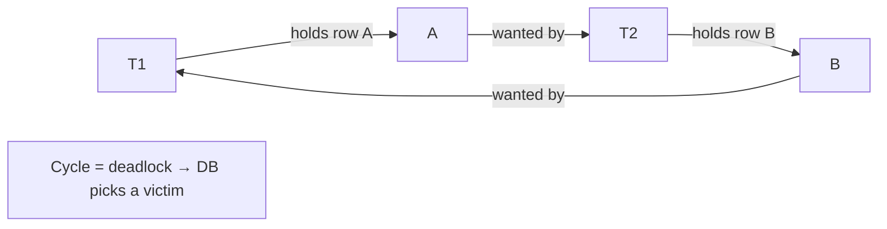

# Module 06 — Concurrency Control

> **Agent spawn**: `@Memory.md` + `@Prompt.md` + this file + `@NOTES.md`
> **Nav**: ← [05 Transactions & ACID](../05-transactions-acid/MODULE.md) · Next → [07 Storage & Query Exec](../07-storage-query-execution/MODULE.md)

## At a glance
| | |
|---|---|
| Prerequisites | 05 |
| Duration | ~1–2 sessions |
| Exit test | 2PL serializability + optimistic vs pessimistic |

## Visual map
```
Lock compatibility:
        Shared(S)  Exclusive(X)
  S        ✓           ✗
  X        ✗           ✗

2PL: Growing phase (acquire locks) → Shrinking phase (release)
     Strict 2PL: hold X-locks till commit  → no cascading aborts
```

**Mental model**: Concurrency control = serializability dilana bina sab kuch serial chalaaye. Pessimistic = pehle lock lo (conflict zyada ho toh). Optimistic = bina lock chalo, commit pe check karo (conflict kam ho toh).

**Redraw challenge**: Lock compatibility matrix + 2PL two phases.

## Objectives
1. Shared/exclusive locks + granularity
2. 2PL + strict 2PL → serializability
3. DB deadlock detection + victim
4. Optimistic vs pessimistic; timestamp ordering

## Topics
- Lock modes (S/X); granularity (row/page/table); intention locks
- 2PL, strict 2PL, rigorous 2PL; cascading aborts
- Serializability: conflict vs view; precedence graph
- Deadlock: wait-for graph, detection, victim selection, timeout
- Optimistic concurrency (validation); timestamp ordering
- `SELECT ... FOR UPDATE`; gap locks; row-version conflicts

## Assignments
| # | Task | Passing criteria |
|---|------|------------------|
| A1 | Cause a DB deadlock with 2 sessions, observe victim | Deadlock detected + explained |
| A2 | Inventory decrement: pessimistic (`FOR UPDATE`) vs optimistic (version) | Both correct under concurrency; trade-off explained |

## Active recall bank
1. Strict 2PL cascading aborts kaise rokta?
2. Optimistic kab pessimistic se behtar?
3. Conflict serializability precedence graph se kaise check?

## Progress checklist
- [ ] Lock matrix + 2PL from memory
- [ ] A1, A2 done
- [ ] NOTES.md updated
