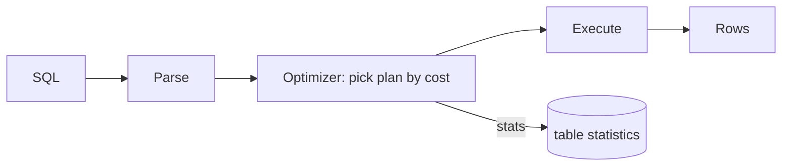

# Module 07 — Storage & Query Execution

> **Agent spawn**: `@Memory.md` + `@Prompt.md` + this file + `@NOTES.md`
> **Nav**: ← [06 Concurrency Control](../06-concurrency-control/MODULE.md) · Next → [08 NoSQL & CAP](../08-nosql-cap/MODULE.md)

## At a glance
| | |
|---|---|
| Prerequisites | 04 |
| Duration | ~1–2 sessions |
| Exit test | 3 join algos + read EXPLAIN ANALYZE + N+1 |

## Visual map

```
JOIN algorithms:
  Nested Loop : for each outer row → probe inner (good: small + indexed)
  Hash Join   : build hash table on one side, probe (good: large equi-join)
  Merge Join  : both sorted on key → merge (good: pre-sorted / range)

EXPLAIN: seq scan vs index scan; rows estimated vs actual
```
**Mental model**: Optimizer = cost-based planner. Statistics galat → bura plan. EXPLAIN ANALYZE padhna = sabse practical interview skill. N+1 = loop mein per-row query, ek join se fix.

**Redraw challenge**: Query pipeline (parse→optimize→execute) + 3 join algos.

## Objectives
1. Row vs column store; pages/buffer pool
2. Query pipeline + optimizer + statistics
3. Join algorithms — when each
4. Reading EXPLAIN ANALYZE; N+1

## Topics
- Row vs column store (OLTP vs OLAP)
- Pages, heap, tuples, buffer pool
- Parse → optimize (cost-based) → execute; statistics + cardinality estimation
- Join algos: nested loop / hash / merge; external sort
- `EXPLAIN` / `EXPLAIN ANALYZE`; seq vs index scan
- N+1 query problem + fix (join / batch)

## Assignments
| # | Task | Passing criteria |
|---|------|------------------|
| A1 | Read an EXPLAIN ANALYZE, find slow node, propose fix | Correct bottleneck + valid fix (index/rewrite) |
| A2 | Compare seq scan vs index scan timings | Measured difference + explanation |

## Active recall bank
1. Hash join kab merge join se accha?
2. Optimizer galat plan kab chunega (stale stats)?
3. N+1 problem + 2 fixes?
4. Column store OLAP ke liye kyun?

## Progress checklist
- [ ] Join algos + pipeline from memory
- [ ] A1, A2 done
- [ ] NOTES.md updated
