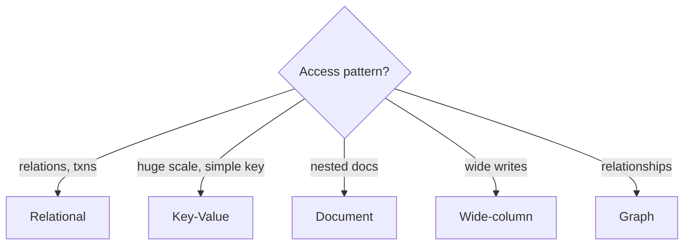

# Module 08 — NoSQL & CAP

> **Agent spawn**: `@Memory.md` + `@Prompt.md` + this file + `@NOTES.md`
> **Nav**: ← [07 Storage & Query Exec](../07-storage-query-execution/MODULE.md) · Next → [09 Sharding & Replication](../09-sharding-replication/MODULE.md)

## At a glance
| | |
|---|---|
| Prerequisites | 05 |
| Duration | ~1–2 sessions |
| Exit test | CAP partition decision + quorum + SQL vs NoSQL |

## Visual map
```
CAP (partition P ho hi jayega distributed mein):
  CP : partition pe consistency rakho, availability chhodo (e.g. HBase)
  AP : partition pe available raho, stale serve karo (e.g. Cassandra, Dynamo)
  CA : sirf single-node (no partition)

Quorum: N replicas, W write-ack, R read-from
  R + W > N  → strong-ish consistency
```

**Mental model**: NoSQL = scale + flexible schema ke liye ACID/relations ka kuch trade. CAP = partition ke time C ya A choose karo (P optional nahi). Modeling NoSQL mein "access pattern pehle, schema baad".

**Redraw challenge**: CAP triangle + CP/AP examples + quorum R+W>N.

## Objectives
1. NoSQL types + when each
2. CAP + PACELC; BASE vs ACID
3. Eventual consistency + quorum
4. SQL vs NoSQL decision

## Topics
- KV (Redis/DynamoDB), document (Mongo), wide-column (Cassandra), graph (Neo4j)
- CAP theorem; PACELC (latency vs consistency even without partition)
- BASE vs ACID; eventual consistency; read-repair, hinted handoff
- Quorum: R+W>N; tunable consistency
- NoSQL data modeling (denormalize, access-pattern-first)

## Assignments
| # | Task | Passing criteria |
|---|------|------------------|
| A1 | Model a cart/feed in SQL and a document store, compare | Trade-offs articulated |
| A2 | Pick CP vs AP for 3 scenarios + justify | Correct + reasoned |

## Active recall bank
1. CAP mein "P optional nahi" kyun?
2. R+W>N kya guarantee deta?
3. Cassandra AP kaise (tunable)?
4. PACELC CAP se kya extra kehta?

## Progress checklist
- [ ] CAP + quorum from memory
- [ ] A1, A2 done
- [ ] NOTES.md updated
