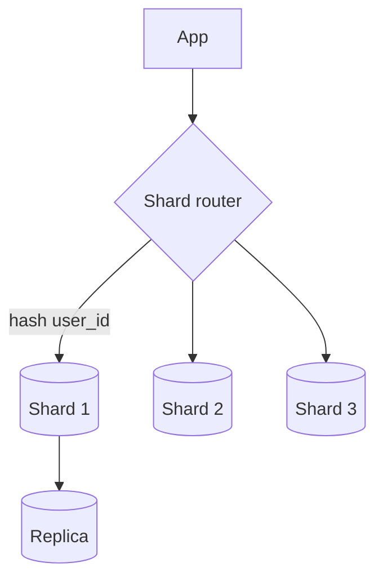

# Module 09 — Sharding & Replication

> **Agent spawn**: `@Memory.md` + `@Prompt.md` + this file + `@NOTES.md`
> **Nav**: ← [08 NoSQL & CAP](../08-nosql-cap/MODULE.md) · Next → [10 Schema Design Practice](../10-schema-design-practice/MODULE.md)

## At a glance
| | |
|---|---|
| Prerequisites | 08 |
| Duration | ~1–2 sessions |
| Exit test | Shard key choice + sync/async replication trade-off |

## Visual map

```
SHARDING (split data across nodes):
  range  : by value range (hot ranges risk)
  hash   : hash(key) % N (even, but resharding pain)
  consistent hashing : minimal movement on add/remove node

REPLICATION (copy data):
  sync  : strong, slower writes
  async : fast, replication LAG (stale reads)
```
**Mental model**: Sharding = data baant kar horizontal scale (write + storage). Replication = copies for read-scale + HA. Shard key galat = hot shards. Async replica = read-after-write stale ho sakta.

**Redraw challenge**: Router→shards→replicas + sync vs async trade-off.

## Objectives
1. Partitioning (vertical/horizontal); sharding strategies
2. Consistent hashing + hot shards + resharding
3. Replication models + lag
4. Failover; CDC

## Topics
- Vertical vs horizontal partitioning
- Sharding: range, hash, directory, consistent hashing
- Hot shard problem; resharding; cross-shard joins/txns pain
- Replication: leader-follower, multi-leader, leaderless; sync vs async
- Read replicas + replication lag; read-your-writes
- Failover, split-brain; CDC (→ outbox/Kafka CV hook)

## Assignments
| # | Task | Passing criteria |
|---|------|------------------|
| A1 | Choose a shard key for multi-tenant app, defend | Avoids hot shards, supports queries |
| A2 | Reason read-after-write with async replicas + fix | Correct staleness analysis + fix (sticky/leader read) |

## Active recall bank
1. Consistent hashing resharding pain kaise kam karta?
2. Sync vs async replication — write latency vs durability?
3. Hot shard kab banta, kaise avoid?
4. Cross-shard transaction kyun mushkil?

## Progress checklist
- [ ] Sharding + replication from memory
- [ ] A1, A2 done
- [ ] NOTES.md updated
