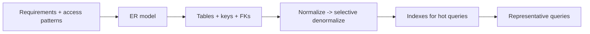

# Module 10 — Schema Design Practice 🔥

> **Agent spawn**: `@Memory.md` + `@Prompt.md` + this file + `@NOTES.md`
> **Nav**: ← [09 Sharding & Replication](../09-sharding-replication/MODULE.md)

## At a glance
| | |
|---|---|
| Prerequisites | 01–09 |
| Duration | ~3+ sessions |
| Exit test | Defend a full schema + write any top-N-per-group query |

## Visual map

**Mental model**: Real interview = "design schema for X". Process: requirements + access patterns → ER → schema → normalize → index hot paths → write the 5 queries that matter. Defend every choice.

**Redraw challenge**: The schema-design pipeline above, from memory.

## Design problems (pick 3+ → ER + schema + indexes + 5 queries each)
1. **E-commerce orders** (products, carts, orders, payments, inventory)
2. **Social feed + followers** (users, follows, posts, likes; fan-out)
3. **Ride-hailing** (riders, drivers, trips, locations, pricing)
4. **URL shortener + analytics** (links, clicks, time-series rollups)
5. **Banking ledger** 🏦 (accounts, double-entry postings, balances) — CV anchor
6. **Multi-tenant SaaS metering** (tenants, usage events idempotent, invoices)

## SQL drill bank (LeetCode-DB style — khud likho)
| Drill | Skill |
|-------|-------|
| Top-N per group | window ROW_NUMBER/RANK |
| Median per group | percentile / window |
| Running balance | window SUM OVER |
| Sessionization | LAG + gaps-and-islands |
| Funnel / conversion | conditional aggregation |
| Cohort retention | date bucketing + joins |
| Pivot (rows→cols) | CASE + GROUP BY |
| Nth highest, with ties | DENSE_RANK |

## Assignments
| # | Task | Passing criteria |
|---|------|------------------|
| A1 | Banking ledger schema (double-entry) + 5 queries | Balances always reconcile; queries correct |
| A2 | 8 SQL drills above on sample data | Each returns correct result, you explain plan |

## Active recall bank
1. Fan-out-on-write vs fan-out-on-read (feed) — trade-off?
2. Double-entry ledger consistency kaise enforce?
3. Idempotent usage metering schema kaise?
4. Top-N-per-group query likho (bina dekhe)?

## Progress checklist
- [ ] 3 design problems done end-to-end
- [ ] 8 SQL drills pass
- [ ] **DB spaced-rep checklist** (LEARNING-PLAN) full pass
- [ ] NOTES.md updated
