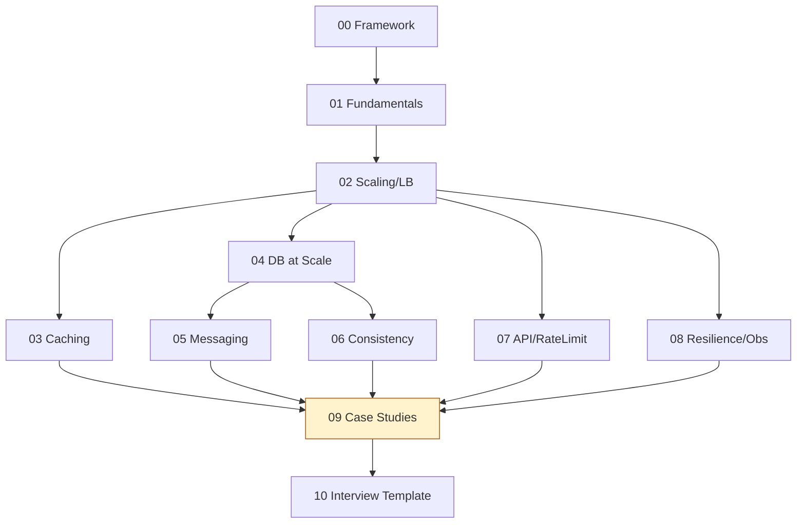

# System Design (HLD) — Home

> HLD vault entry point. ← back to [[INTERVIEW-PREP|Master Index]]

## Quick links
| Doc | Kya hai |
|-----|---------|
| [[HLD/Memory\|Memory]] | Coach rules, profile, CV→HLD hooks |
| [[HLD/Prompt\|Prompt]] | Hinglish coach persona |
| [[HLD/LEARNING-PLAN\|LEARNING-PLAN]] | **Full syllabus** + 12 case studies |
| [[HLD/VISUAL-STUDY-GUIDE\|VISUAL-STUDY-GUIDE]] | Master diagrams + estimation cheat sheet |

## Modules
| # | Syllabus | Notes | Focus |
|---|----------|-------|-------|
| 00 | [[HLD/modules/00-framework/MODULE\|The Framework]] | [[HLD/modules/00-framework/NOTES\|NOTES]] | How to attack any design Q |
| 01 | [[HLD/modules/01-fundamentals-estimation/MODULE\|Fundamentals & Estimation]] | [[HLD/modules/01-fundamentals-estimation/NOTES\|NOTES]] | Latency, throughput, back-of-envelope |
| 02 | [[HLD/modules/02-scaling-load-balancing/MODULE\|Scaling & Load Balancing]] | [[HLD/modules/02-scaling-load-balancing/NOTES\|NOTES]] | Horizontal, LB, stateless |
| 03 | [[HLD/modules/03-caching/MODULE\|Caching]] | [[HLD/modules/03-caching/NOTES\|NOTES]] | Strategies, eviction, invalidation |
| 04 | [[HLD/modules/04-databases-at-scale/MODULE\|Databases at Scale]] | [[HLD/modules/04-databases-at-scale/NOTES\|NOTES]] | SQL/NoSQL, shard, replicate |
| 05 | [[HLD/modules/05-messaging-async/MODULE\|Messaging & Async]] | [[HLD/modules/05-messaging-async/NOTES\|NOTES]] | Queues, Kafka, outbox |
| 06 | [[HLD/modules/06-consistency-consensus/MODULE\|Consistency & Consensus]] | [[HLD/modules/06-consistency-consensus/NOTES\|NOTES]] | CAP, Raft, quorum |
| 07 | [[HLD/modules/07-api-ratelimit-idempotency/MODULE\|API, Rate Limit, Idempotency]] | [[HLD/modules/07-api-ratelimit-idempotency/NOTES\|NOTES]] | API design, limits |
| 08 | [[HLD/modules/08-resilience-observability/MODULE\|Resilience & Observability]] | [[HLD/modules/08-resilience-observability/NOTES\|NOTES]] | Circuit breaker, OTEL |
| 09 | [[HLD/modules/09-case-studies/MODULE\|Case Studies]] 🔥 | [[HLD/modules/09-case-studies/NOTES\|NOTES]] | 12 classic designs |
| 10 | [[HLD/modules/10-interview-template/MODULE\|Interview Template]] | [[HLD/modules/10-interview-template/NOTES\|NOTES]] | Mock framework |

## Reading workflow
1. **Module 00 (framework) pehle** — har design isi se attack karoge
2. Building blocks 01–08 padho — har ek ka diagram
3. Module 09: har case study khud design karo, phir compare
4. Redraw challenge → `NOTES.md → My diagrams`
5. Coach: `@Memory.md @Prompt.md @modules/XX/MODULE.md`

## Dependency order


## Vault path
```
/Users/vansh/Desktop/Code/Learning/HLD
```
