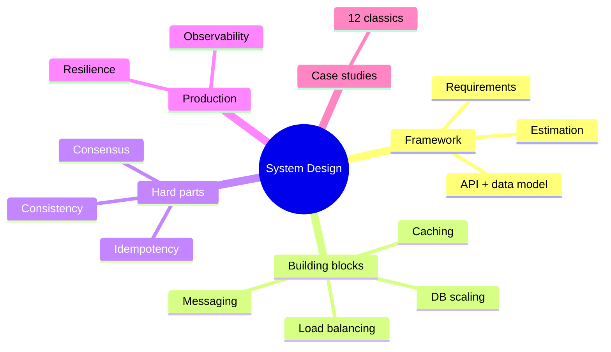
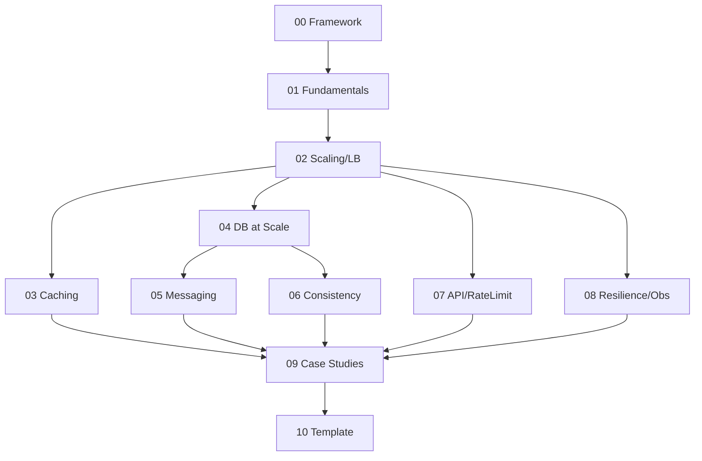

# System Design (HLD) — Learning Plan (Full Syllabus)

> **Visual learner**: har module `## Visual map`. Start: `@VISUAL-STUDY-GUIDE.md`.
> **No standard topic/case-study left out.** Module 09 = 12 classic designs.

## Mind map

## Dependency graph

---

## Module 00 — The Framework
**Topics**: How to attack ANY design question; the 7-step flow (clarify requirements → functional vs non-functional → estimate scale → API contract → data model → high-level diagram → deep-dive + bottlenecks/trade-offs); driving vs being driven; communicating trade-offs out loud.
**Exit**: recite the 7 steps; turn a vague prompt ("design Twitter") into scoped requirements.

## Module 01 — Fundamentals & Estimation
**Topics**: Latency vs throughput; latency numbers every programmer should know; back-of-envelope (QPS, storage, bandwidth, memory); read:write ratio; powers of 10; SLA/SLO/SLI; availability (9s); peak vs average; capacity planning.
**Assignments**: A1 estimate storage+QPS+bandwidth for a photo-sharing app (200M DAU); A2 compute how many servers for X QPS.
**Exit**: latency table from memory; estimate any app's storage/QPS/bandwidth; 99.99% downtime/year.

## Module 02 — Scaling & Load Balancing
**Topics**: Vertical vs horizontal scaling; stateless vs stateful; load balancers (L4 vs L7); LB algorithms (round-robin, least-conn, hashing, consistent hashing); health checks; sticky sessions; reverse proxy; API gateway; auto-scaling; single point of failure.
**Assignments**: A1 design the LB tier for a stateless web app + handle session state; A2 where to put consistent hashing + why.
**Exit**: L4 vs L7; stateless kyun zaroori for horizontal scale; consistent hashing use cases.

## Module 03 — Caching
**Topics**: Why cache; client/CDN/app/DB caches; cache patterns (cache-aside, read-through, write-through, write-back, write-around); eviction (LRU/LFU/FIFO/TTL); **cache invalidation** (the hard problem); thundering herd / cache stampede; hot keys; Redis (data structures, persistence, cluster); CDN + edge.
**Assignments**: A1 pick caching pattern for read-heavy product catalog; A2 design cache for hot keys + stampede protection.
**Exit**: 4 write patterns trade-offs; invalidation strategies; stampede fix (lock/early-expire); hot key handling.

## Module 04 — Databases at Scale
**Topics**: SQL vs NoSQL decision; replication (leader-follower, lag, read replicas); sharding (range/hash/consistent-hash, hot shards); partitioning; denormalization for reads; CQRS; secondary indexes at scale; multi-region; choosing a DB. (Builds on Database vault modules 08–09.)
**Assignments**: A1 design data layer for a feed (sharding + replicas); A2 read-after-write consistency with replicas.
**Exit**: SQL vs NoSQL decision; sharding strategy + hot shard; replication lag handling.

## Module 05 — Messaging & Async Processing
**Topics**: Sync vs async; message queues vs pub/sub vs log (Kafka); when async; at-most/at-least/exactly-once; **outbox pattern** (CV anchor); idempotent consumers; dead-letter queues; backpressure; fan-out; event-driven architecture; stream processing basics.
**Assignments**: A1 design notification fan-out (1 event → 1M users); A2 exactly-once order processing with outbox + Kafka.
**Exit**: queue vs log vs pub-sub; exactly-once via outbox + idempotency; DLQ + backpressure.

## Module 06 — Consistency & Consensus
**Topics**: CAP + PACELC (revisit); consistency models (strong, eventual, causal, read-your-writes, monotonic); quorum (R+W>N); **consensus** (why, Raft leader election + log replication intuition, Paxos mention); distributed transactions (2PC + its blocking problem, saga + compensation — CV: savepoints); vector clocks / logical clocks; conflict resolution (LWW, CRDT mention).
**Assignments**: A1 choose consistency model for 3 features (balance, likes, username); A2 sketch saga for a multi-step payment + compensation.
**Exit**: consistency models ladder; quorum math; Raft in 3 sentences; saga vs 2PC.

## Module 07 — API Design, Rate Limiting, Idempotency
**Topics**: REST vs gRPC vs GraphQL; API versioning; pagination (offset vs cursor); **rate limiting** algorithms (token bucket, leaky bucket, fixed/sliding window — CV: token bucket); **idempotency** keys (CV: exactly-once); webhooks; API gateway responsibilities; auth (JWT/OAuth basics).
**Assignments**: A1 design a distributed rate limiter (Redis-backed, multi-instance); A2 idempotent payment API with idempotency keys.
**Exit**: 4 rate-limit algos trade-offs; distributed rate limiter design; idempotency key flow; cursor vs offset pagination.

## Module 08 — Resilience & Observability
**Topics**: Failure modes; redundancy; **circuit breaker** (CV hook), retries (+ exponential backoff + jitter), timeouts, bulkhead, fallback; graceful degradation; load shedding; health checks; **observability** (metrics/logs/traces — CV: Prometheus/OTEL); the four golden signals; alerting; chaos engineering intro.
**Assignments**: A1 add resilience to a flaky downstream dependency; A2 define SLIs + the 4 golden signals for a service.
**Exit**: circuit breaker states; retry storm + jitter; metrics vs logs vs traces; 4 golden signals.

## Module 09 — Case Studies 🔥 (design each yourself first)
1. **URL shortener** (TinyURL) — hashing, KV, redirect, analytics
2. **Rate limiter** (distributed) — token bucket + Redis
3. **News feed** (Twitter/Instagram) — fan-out write vs read, timeline
4. **Chat / WhatsApp** — WebSockets, presence, delivery receipts, fan-out (CV: pub-sub)
5. **YouTube / Netflix** — video storage, CDN, transcoding, streaming
6. **Uber / ride-hailing** — geospatial index, matching (CV: matching engine), surge
7. **Twitter search / typeahead** — inverted index, trie, ranking
8. **Google Drive / Dropbox** — chunking, dedup, sync, metadata
9. **Web crawler** — BFS, politeness, dedup, distributed frontier
10. **Notification system** — multi-channel fan-out, dedup, retries (CV: outbox)
11. **Payment system / wallet** 🏦 — ledger, idempotency, reconciliation (CV anchor)
12. **Distributed cache / key-value store** — consistent hashing, replication, quorum
**Assignments**: design 6+ end-to-end using the framework; write up trade-offs in NOTES.
**Exit**: design any of the 12 in ~40 min with estimation + data model + deep-dive + trade-offs.

## Module 10 — Interview Template
**Topics**: Time-boxing a 45-min round; what interviewers score (clarify, structure, trade-offs, communication, depth); red flags; how to deep-dive when asked; handling "scale it 100x"; mock self-evaluation rubric.
**Exit**: a repeatable personal template + a self-scoring rubric.

---

## Weekly rhythm
| Day | Focus |
|-----|-------|
| Mon–Tue | Building-block concept + recall |
| Wed–Thu | Design a case study end-to-end |
| Fri | Trade-off poking + NOTES |
| Sat | Spaced recall (estimation, CAP) |
| Sun | Buffer / mock |

## Spaced repetition checklist (har 2 modules)
- [ ] Latency numbers table
- [ ] 4 caching write patterns
- [ ] CAP / consistency models ladder
- [ ] Rate-limit algorithms
- [ ] Exactly-once via outbox
- [ ] Sharding + hot shard
- [ ] Circuit breaker states
