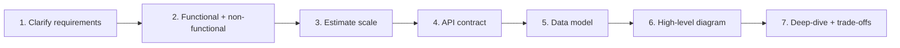

# HLD Visual Study Guide — Vansh

> Visual learner master sheet. Architecture diagrams pehle, redraw se recall.

## The framework (attack ANY design Q)


## Generic scalable architecture (template)
```
Client → DNS → CDN → Load Balancer → [App servers (stateless) xN]
                                          │
              ┌───────────────┬───────────┼────────────┐
            Cache(Redis)   DB (leader)   Queue(Kafka)  Object store(S3)
                            │  └─ replicas
                         shards
```

## Estimation numbers (MEMORIZE)
```
L1 cache       ~1 ns
RAM read       ~100 ns
SSD read       ~100 µs
Network RTT(DC)~0.5 ms
Disk seek      ~10 ms
Cross-region   ~50–150 ms

1 day ≈ 86,400 s ≈ 10^5 s
QPS = daily_requests / 10^5
Availability: 99.9% = 8.7h/yr down | 99.99% = 52min | 99.999% = 5min
```

## Caching write patterns
```
cache-aside   : app reads cache, miss→DB→fill (most common)
read-through  : cache loads from DB itself
write-through : write cache + DB together (consistent, slow write)
write-back    : write cache, async to DB (fast, risk loss)
write-around  : write DB only, cache on read (avoid cache churn)
```

## CAP / consistency ladder
```
strong  ─────────────────────► eventual
  |          |          |          |
linearizable read-your-writes  causal   eventual
(slow, safe)                          (fast, stale)
Quorum: R + W > N  → overlap → consistent reads
```

## Rate limiting
```
Token bucket : tokens refill at rate r, burst up to capacity (CV: tumne banaya)
Leaky bucket : constant outflow, smooths bursts
Fixed window : count per window (boundary spike problem)
Sliding window: weighted/log (accurate, costlier)
```

## CV → HLD bridge
```
Outbox + Kafka exactly-once ──► Async, queues, idempotent consumers
Matching engine (Redis)     ──► Real-time, WebSockets, in-memory
Savepoints / rollback       ──► Saga + compensation
Bank reconciliation         ──► Idempotency, audit, eventual consistency
Rate limiter (token bucket) ──► API gateway throttling
Prometheus p99              ──► Observability, golden signals
```

## Spaced-rep recall bank
1. 7-step framework?
2. QPS = ? formula
3. 4 caching write patterns?
4. R+W>N kya deta?
5. Exactly-once kaise (outbox)?
6. Circuit breaker 3 states?
7. Fan-out write vs read — kab kya?
