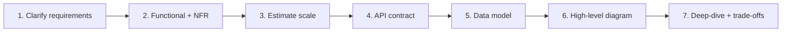

# Module 00 — The Framework

> **Agent spawn**: `@Memory.md` + `@Prompt.md` + this file + `@NOTES.md`
> **Nav**: Next → [01 Fundamentals & Estimation](../01-fundamentals-estimation/MODULE.md)

## At a glance
| | |
|---|---|
| Prerequisites | None |
| Duration | ~1 session |
| Exit test | 7 steps recite + scope a vague prompt |

## Visual map

**Mental model**: Interview design Q random nahi attack karna. Yeh 7-step pipeline har baar. Sabse common galti: seedha boxes banana bina requirements/scale clarify kiye. **Tum drive karte ho**, interviewer ko bolte rehte ho "main yeh assume kar raha hun kyunki...".

**Redraw challenge**: 7-step framework bina dekhe.

## Objectives
1. The 7-step flow har design ke liye
2. Functional vs non-functional requirements
3. Driving the conversation; communicating trade-offs
4. Scoping a vague prompt

## Topics
- Requirements: functional (kya karega) vs non-functional (scale, latency, availability, consistency)
- Why estimate before designing
- API-first then data model then architecture
- Deep-dive: interviewer ke hint pe ek component detail mein
- Always say trade-offs out loud

## Assignments
| # | Task | Passing criteria |
|---|------|------------------|
| A1 | "Design Twitter" → write scoped requirements + NFRs | Functional + non-functional separated, assumptions stated |
| A2 | List the 3 clarifying questions you'd ask for any design | Reusable, sharp questions |

## Active recall bank
1. 7 steps in order?
2. Functional vs non-functional — 3 examples each?
3. Estimate pehle kyun, design baad mein?

## Progress checklist
- [ ] 7 steps from memory
- [ ] A1, A2 done
- [ ] NOTES.md updated
