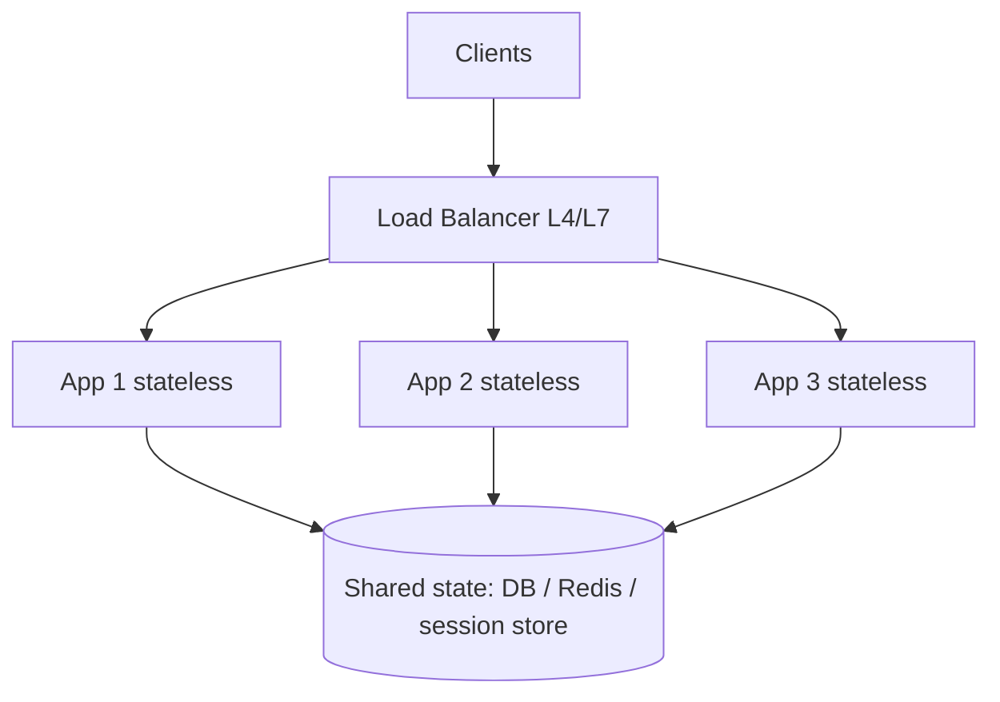

# Module 02 — Scaling & Load Balancing

> **Agent spawn**: `@Memory.md` + `@Prompt.md` + this file + `@NOTES.md`
> **Nav**: ← [01 Fundamentals](../01-fundamentals-estimation/MODULE.md) · Next → [03 Caching](../03-caching/MODULE.md)

## At a glance
| | |
|---|---|
| Prerequisites | 01 |
| Duration | ~1 session |
| Exit test | L4 vs L7 + why stateless + consistent hashing |

## Visual map

```
Vertical: bigger machine (limit + SPOF)
Horizontal: more machines (needs stateless + LB)
LB algos: round-robin, least-conn, IP/consistent hash
```
**Mental model**: Horizontal scale ke liye app stateless hona chahiye — state baahar (Redis/DB) rakho taaki koi bhi server koi bhi request handle kar sake. LB = traffic baant-ne wala + health check. Consistent hashing = nodes add/remove pe minimal reshuffle.

**Redraw challenge**: LB → stateless app tier → shared state diagram.

## Objectives
1. Vertical vs horizontal; stateless vs stateful
2. L4 vs L7 LB; LB algorithms
3. Consistent hashing; sticky sessions
4. API gateway; auto-scaling; SPOF

## Topics
- Scaling axes; why stateless enables horizontal
- L4 (transport) vs L7 (application) load balancing
- LB algorithms: round-robin, least-connections, hashing, consistent hashing
- Health checks; sticky sessions (and why to avoid)
- Reverse proxy vs API gateway; auto-scaling; removing SPOF

## Assignments
| # | Task | Passing criteria |
|---|------|------------------|
| A1 | Design LB tier for stateless web app + where session state lives | No SPOF, state externalized |
| A2 | Where + why consistent hashing in your design | Correct use case + benefit |

## Active recall bank
1. L4 vs L7 — kya dekh kar route?
2. Stateless kyun zaroori horizontal scale ke liye?
3. Consistent hashing normal hashing se kaise behtar?

## Progress checklist
- [ ] LB diagram + consistent hashing from memory
- [ ] A1, A2 done
- [ ] NOTES.md updated
