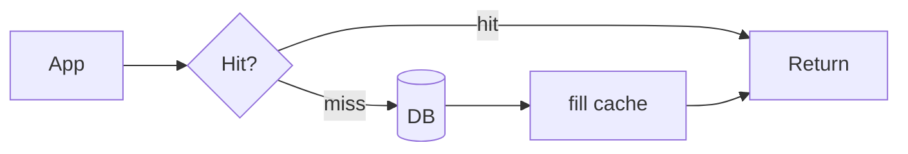

# Module 03 — Caching

> **Agent spawn**: `@Memory.md` + `@Prompt.md` + this file + `@NOTES.md`
> **Nav**: ← [02 Scaling & LB](../02-scaling-load-balancing/MODULE.md) · Next → [04 DB at Scale](../04-databases-at-scale/MODULE.md)

## At a glance
| | |
|---|---|
| Prerequisites | 02 |
| Duration | ~1–2 sessions |
| Exit test | 4 write patterns + invalidation + stampede fix |

## Visual map
```
WRITE PATTERNS:
  cache-aside   app: read cache→miss→DB→fill ; write: update DB + invalidate
  write-through write cache+DB together (consistent, slower)
  write-back    write cache, async flush DB (fast, risk loss)
  write-around  write DB only, cache fills on read

LAYERS: browser → CDN → app cache → DB cache
```

**Mental model**: Cache = mehnga read bachao. Hardest part = invalidation (stale data). Stampede = cache miss pe sab ek saath DB hit karein → lock/early-recompute se bachao. Hot key = ek key pe poora load → replicate/shard.

**Redraw challenge**: cache-aside read+write flow + the 4 write patterns.

## Objectives
1. Cache layers + why
2. 4 write patterns + eviction policies
3. Invalidation + stampede + hot keys
4. Redis + CDN basics

## Topics
- Layers: client/CDN/app/DB cache
- Patterns: cache-aside, read-through, write-through, write-back, write-around
- Eviction: LRU/LFU/FIFO/TTL
- Invalidation strategies; TTL vs explicit
- Thundering herd / stampede; hot keys; negative caching
- Redis (structures, persistence, cluster); CDN + edge

## Assignments
| # | Task | Passing criteria |
|---|------|------------------|
| A1 | Caching pattern for read-heavy product catalog + justify | Correct pattern + invalidation plan |
| A2 | Design hot-key + stampede protection | Lock / early-expiry / replication addressed |

## Active recall bank
1. write-through vs write-back trade-off?
2. Cache stampede kya, 2 fixes?
3. Cache-aside mein stale data kaise hota?
4. Hot key problem + fix?

## Progress checklist
- [ ] 4 patterns + stampede from memory
- [ ] A1, A2 done
- [ ] NOTES.md updated
