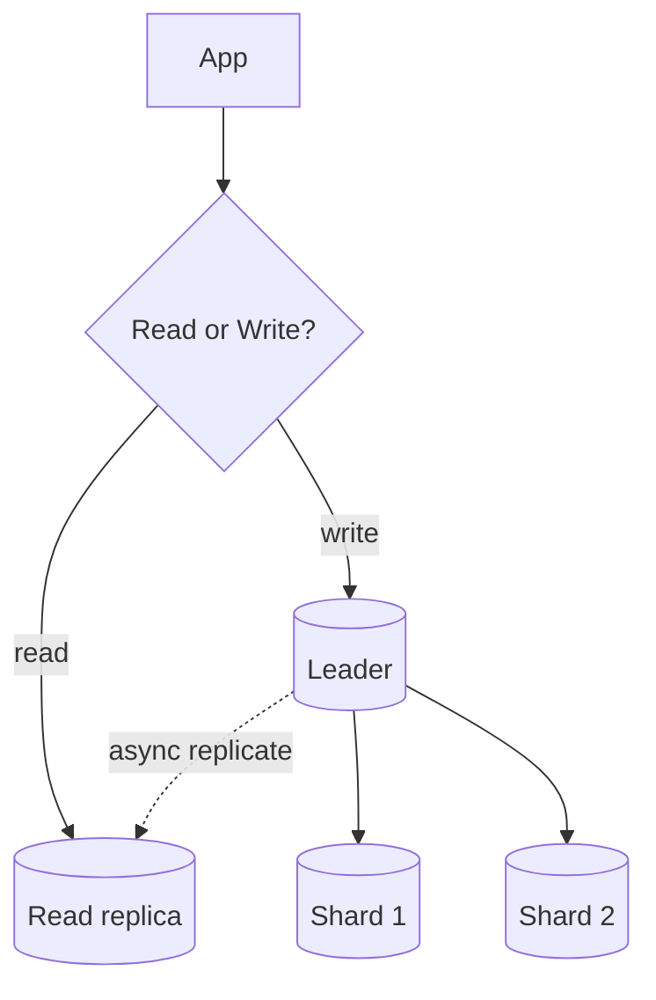

# Module 04 — Databases at Scale

> **Agent spawn**: `@Memory.md` + `@Prompt.md` + this file + `@NOTES.md`
> **Nav**: ← [03 Caching](../03-caching/MODULE.md) · Next → [05 Messaging & Async](../05-messaging-async/MODULE.md)

## At a glance
| | |
|---|---|
| Prerequisites | 02 · (DB vault 08–09 helps) |
| Duration | ~1–2 sessions |
| Exit test | SQL vs NoSQL + sharding + replication lag |

## Visual map

```
Replication = read scale + HA (lag = stale reads)
Sharding    = write + storage scale (hot shard risk)
CQRS        = separate read model from write model
```
**Mental model**: Replication copies banata (reads/HA); sharding data baant-ta (writes/storage). Dono saath. Async replica fast par stale; sync slow par consistent. CV hook: tumne multi-tenant isolation kiya — wahi partitioning.

**Redraw challenge**: Leader/replica + shards + read/write routing.

## Objectives
1. SQL vs NoSQL decision at scale
2. Replication + lag; read replicas
3. Sharding strategies + hot shards
4. CQRS; denormalization; multi-region

## Topics
- SQL vs NoSQL decision factors
- Replication: leader-follower, lag, read-your-writes
- Sharding: range/hash/consistent-hash; hot shard; resharding
- Partitioning; secondary indexes at scale
- CQRS; denormalization for reads; multi-region trade-offs

## Assignments
| # | Task | Passing criteria |
|---|------|------------------|
| A1 | Data layer for a feed (sharding + replicas) | Shard key justified, read path defined |
| A2 | Read-after-write consistency with async replicas | Correct staleness fix (leader read / sticky) |

## Active recall bank
1. Replication vs sharding — kaun kya scale karta?
2. Hot shard kab, kaise avoid?
3. CQRS kab useful?

## Progress checklist
- [ ] Replicate vs shard from memory
- [ ] A1, A2 done
- [ ] NOTES.md updated
