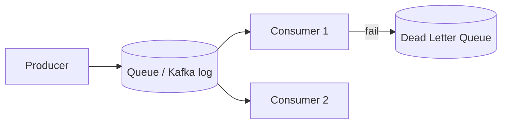

# Module 05 — Messaging & Async Processing

> **Agent spawn**: `@Memory.md` + `@Prompt.md` + this file + `@NOTES.md`
> **Nav**: ← [04 DB at Scale](../04-databases-at-scale/MODULE.md) · Next → [06 Consistency & Consensus](../06-consistency-consensus/MODULE.md)

## At a glance
| | |
|---|---|
| Prerequisites | 04 |
| Duration | ~1–2 sessions |
| Exit test | queue vs log vs pub-sub + exactly-once via outbox |

## Visual map

```
OUTBOX (exactly-once, CV anchor):
  txn { write business row + write outbox row }  → same DB commit
  relay reads outbox → publishes to Kafka → marks sent
  consumer idempotent (dedup by message id)
```
**Mental model**: Async = caller ko wait mat karao, kaam queue mein daalo. Exactly-once "delivery" possible nahi — exactly-once **effect** = at-least-once + idempotent consumer. Outbox = DB write aur event publish ko atomic banata. **Yeh tumhara strongest topic hai.**

**Redraw challenge**: Outbox pattern (txn → relay → Kafka → idempotent consumer).

## Objectives
1. Sync vs async; when async
2. Queue vs pub/sub vs log (Kafka)
3. Delivery semantics + outbox + idempotency
4. DLQ, backpressure, fan-out

## Topics
- Sync vs async; message queue vs pub/sub vs commit log
- At-most / at-least / exactly-once (effect)
- Outbox pattern; idempotent consumers; dedup
- Dead-letter queues; backpressure; retries
- Fan-out; event-driven architecture; stream processing basics

## Assignments
| # | Task | Passing criteria |
|---|------|------------------|
| A1 | Notification fan-out: 1 event → 1M users | Queue + workers + backpressure addressed |
| A2 | Exactly-once order processing (outbox + Kafka) | Atomic write+publish, idempotent consumer |

## Active recall bank
1. Queue vs log (Kafka) — replay/multiple consumers?
2. Exactly-once effect kaise (at-least-once + ?)?
3. Outbox pattern atomicity kaise deta?
4. DLQ + backpressure kab?

## Progress checklist
- [ ] Outbox diagram from memory
- [ ] A1, A2 done
- [ ] NOTES.md updated
