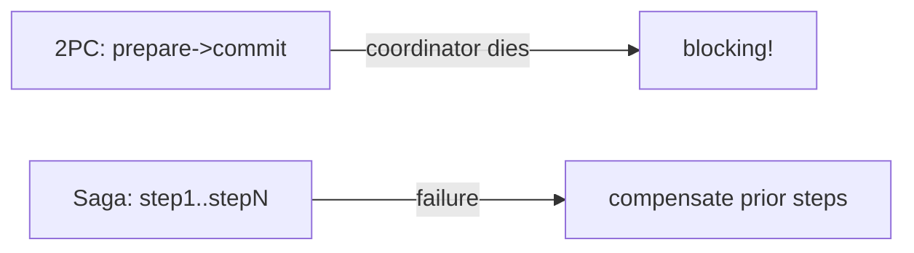

# Module 06 — Consistency & Consensus

> **Agent spawn**: `@Memory.md` + `@Prompt.md` + this file + `@NOTES.md`
> **Nav**: ← [05 Messaging](../05-messaging-async/MODULE.md) · Next → [07 API/RateLimit/Idempotency](../07-api-ratelimit-idempotency/MODULE.md)

## At a glance
| | |
|---|---|
| Prerequisites | 04 |
| Duration | ~2 sessions |
| Exit test | consistency ladder + quorum + saga vs 2PC + Raft in 3 lines |

## Visual map
```
CONSISTENCY LADDER:
  strong/linearizable ─ read-your-writes ─ monotonic ─ causal ─ eventual
  (safe, slow)                                              (fast, stale)

QUORUM: N replicas, R read, W write  →  R + W > N = overlap = consistent

CONSENSUS (Raft): elect leader → leader appends to log → replicate → commit when majority ack
```

**Mental model**: Distributed mein "ek sach" rakhna mushkil. Quorum se overlap force karo. Consensus (Raft) = ek leader sab pe agree karwata. 2PC blocking hai; saga = local txns + compensation (CV: savepoints/rollback = saga ki tarah).

**Redraw challenge**: consistency ladder + quorum R+W>N + saga vs 2PC.

## Objectives
1. CAP/PACELC + consistency models
2. Quorum math
3. Consensus (Raft) intuition
4. Distributed txns: 2PC vs saga

## Topics
- CAP, PACELC revisit
- Consistency models: strong/linearizable, read-your-writes, monotonic, causal, eventual
- Quorum: R+W>N; sloppy quorum, hinted handoff
- Consensus: Raft (leader election, log replication, commit); Paxos mention
- Distributed transactions: 2PC (blocking), saga + compensation
- Logical/vector clocks; conflict resolution (LWW, CRDT mention)

## Assignments
| # | Task | Passing criteria |
|---|------|------------------|
| A1 | Pick consistency model for 3 features (balance, likes, username uniqueness) | Each justified |
| A2 | Sketch a saga for multi-step payment + compensation | Compensating actions for each step |

## Active recall bank
1. Consistency ladder strong→eventual?
2. R+W>N kya guarantee?
3. Raft 3 sentences?
4. 2PC blocking kyun, saga kaise bachata?

## Progress checklist
- [ ] Ladder + quorum + saga from memory
- [ ] A1, A2 done
- [ ] NOTES.md updated
