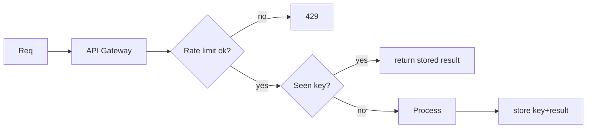

# Module 07 — API Design, Rate Limiting, Idempotency

> **Agent spawn**: `@Memory.md` + `@Prompt.md` + this file + `@NOTES.md`
> **Nav**: ← [06 Consistency](../06-consistency-consensus/MODULE.md) · Next → [08 Resilience & Observability](../08-resilience-observability/MODULE.md)

## At a glance
| | |
|---|---|
| Prerequisites | 02 |
| Duration | ~1–2 sessions |
| Exit test | 4 rate-limit algos + distributed limiter + idempotency key flow |

## Visual map
```
TOKEN BUCKET (CV: tumne banaya):
  bucket capacity C, refill rate r/s
  request → token? yes: serve & remove | no: reject/queue

IDEMPOTENCY:
  client sends Idempotency-Key → server stores key→result
  retry with same key → return stored result (no double charge)
```

**Mental model**: Rate limit = abuse/overload se bachao (token bucket bursty allow karta, leaky smooth). Idempotency = network retry pe double-charge na ho — CV: tumhara exactly-once isi ka cousin. Distributed limiter = Redis mein shared counter.

**Redraw challenge**: token bucket + idempotency-key flow.

## Objectives
1. REST vs gRPC vs GraphQL; versioning; pagination
2. Rate limiting algorithms + distributed limiter
3. Idempotency keys
4. API gateway; auth basics

## Topics
- REST vs gRPC vs GraphQL; versioning; cursor vs offset pagination
- Rate limiting: token bucket, leaky bucket, fixed/sliding window
- Distributed rate limiter (Redis, atomic INCR/Lua)
- Idempotency keys; safe retries
- Webhooks; API gateway responsibilities; JWT/OAuth basics

## Assignments
| # | Task | Passing criteria |
|---|------|------------------|
| A1 | Distributed rate limiter (multi-instance, Redis) | Correct under concurrency, chosen algo justified |
| A2 | Idempotent payment API design | Same key → same result, no double charge |

## Active recall bank
1. Token vs leaky bucket — burst handling?
2. Fixed window ka boundary spike problem?
3. Idempotency key flow?
4. Cursor vs offset pagination — kab kya?

## Progress checklist
- [ ] Rate-limit algos + idempotency from memory
- [ ] A1, A2 done
- [ ] NOTES.md updated
