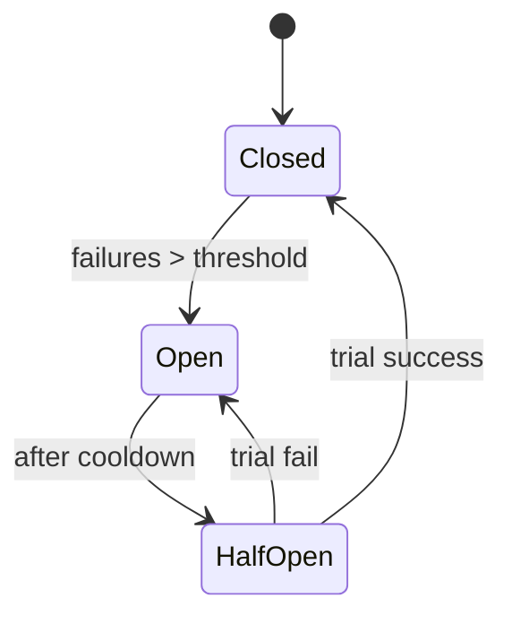

# Module 08 — Resilience & Observability

> **Agent spawn**: `@Memory.md` + `@Prompt.md` + this file + `@NOTES.md`
> **Nav**: ← [07 API/RateLimit](../07-api-ratelimit-idempotency/MODULE.md) · Next → [09 Case Studies](../09-case-studies/MODULE.md)

## At a glance
| | |
|---|---|
| Prerequisites | 02 |
| Duration | ~1 session |
| Exit test | circuit breaker states + retry jitter + 4 golden signals |

## Visual map

```
RESILIENCE: timeout + retry(backoff+jitter) + circuit breaker + bulkhead + fallback
OBSERVABILITY (CV: Prometheus/OTEL):
  Metrics (aggregates) | Logs (events) | Traces (request path)
  4 golden signals: Latency, Traffic, Errors, Saturation
```
**Mental model**: Sab kuch fail hota hai — design fault ke liye. Circuit breaker = baar-baar fail karne wale downstream ko bula-na band karo. Retry bina jitter = retry storm. Observability bina = blind. CV: tumne Prometheus p99 kiya hai — yahi.

**Redraw challenge**: circuit breaker state machine + 4 golden signals.

## Objectives
1. Failure modes + redundancy
2. Circuit breaker, retry+backoff+jitter, timeout, bulkhead, fallback
3. Graceful degradation; load shedding
4. Metrics/logs/traces; golden signals

## Topics
- Failure modes; redundancy; SPOF removal
- Circuit breaker (closed/open/half-open); retries + exponential backoff + jitter
- Timeouts; bulkhead; fallback; graceful degradation; load shedding
- Health checks (liveness/readiness)
- Observability: metrics vs logs vs traces; OTEL; 4 golden signals; alerting; chaos eng intro

## Assignments
| # | Task | Passing criteria |
|---|------|------------------|
| A1 | Add resilience to a flaky downstream dependency | CB + timeout + retry-jitter + fallback |
| A2 | Define SLIs + 4 golden signals for a service | Correct, measurable |

## Active recall bank
1. Circuit breaker 3 states + transitions?
2. Retry storm kya, jitter kaise bachata?
3. Metrics vs logs vs traces — kab kya?
4. 4 golden signals?

## Progress checklist
- [ ] CB states + golden signals from memory
- [ ] A1, A2 done
- [ ] NOTES.md updated
