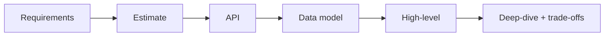

# Module 09 — Case Studies 🔥

> **Agent spawn**: `@Memory.md` + `@Prompt.md` + this file + `@NOTES.md`
> **Nav**: ← [08 Resilience & Observability](../08-resilience-observability/MODULE.md) · Next → [10 Interview Template](../10-interview-template/MODULE.md)

## At a glance
| | |
|---|---|
| Prerequisites | 00–08 |
| Duration | ~6+ sessions (1 design each) |
| Exit test | Design any of the 12 in ~40 min |

## Visual map

**Mental model**: Har case study ko module 00 ke framework se attack karo. Pehle khud design karo (timer laga ke), phir gaps note karo. Pattern recognition build hota hai — feed/chat/notification sab fan-out hain; URL-shortener/typeahead sab KV+index hain.

**Redraw challenge**: For each design — the high-level architecture from memory.

## The 12 classics (design each yourself first, then refine with coach)
| # | Design | Core ideas | CV hook |
|---|--------|-----------|---------|
| 1 | **URL shortener** | hashing/base62, KV, redirect, analytics | — |
| 2 | **Distributed rate limiter** | token bucket + Redis, atomic | token bucket |
| 3 | **News feed** (Twitter/IG) | fan-out write vs read, timeline cache | — |
| 4 | **Chat / WhatsApp** | WebSockets, presence, delivery receipts | Redis pub-sub |
| 5 | **YouTube / Netflix** | object store, CDN, transcoding, adaptive stream | — |
| 6 | **Uber / ride-hailing** | geohash/quadtree, matching, surge | matching engine |
| 7 | **Typeahead / search** | trie, inverted index, ranking | — |
| 8 | **Google Drive / Dropbox** | chunking, dedup, sync, metadata | — |
| 9 | **Web crawler** | BFS frontier, politeness, dedup, distributed | — |
| 10 | **Notification system** | multi-channel fan-out, dedup, retries | outbox |
| 11 | **Payment system / wallet** 🏦 | ledger, idempotency, reconciliation | CV anchor |
| 12 | **Distributed KV store** | consistent hashing, replication, quorum | — |

## Assignments
| # | Task | Passing criteria |
|---|------|------------------|
| A1 | Design 6+ above end-to-end (framework) | Each: estimate + API + data + high-level + deep-dive + trade-offs |
| A2 | For payment system, design idempotent + reconciled ledger | Double-entry, exactly-once, audit |

## Active recall bank
1. Feed: fan-out write vs read — celebrity problem?
2. Chat delivery receipts kaise (sent/delivered/read)?
3. Uber matching geospatial index kaise?
4. URL shortener collision kaise handle?

## Progress checklist
- [ ] 6+ designs done end-to-end
- [ ] Payment system deep-dive done
- [ ] NOTES.md updated (each design's trade-offs)
