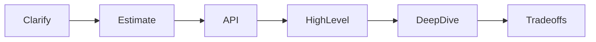

# Module 10 — Interview Template

> **Agent spawn**: `@Memory.md` + `@Prompt.md` + this file + `@NOTES.md`
> **Nav**: ← [09 Case Studies](../09-case-studies/MODULE.md)

## At a glance
| | |
|---|---|
| Prerequisites | 00–09 |
| Duration | ~1 session + repeated mocks |
| Exit test | Run a 45-min mock self-scored ≥ bar |

## Visual map
```
45-MIN ROUND TIME-BOX:
  0-5min   clarify requirements + scope
  5-10min  estimate scale
  10-15min API + data model
  15-30min high-level design (draw, talk trade-offs)
  30-40min deep-dive (interviewer's pick)
  40-45min bottlenecks, failures, "scale 100x", wrap
```

**Mental model**: Interviewer score karta: (1) requirements clarify kiye? (2) structured? (3) trade-offs bole? (4) communication? (5) depth jab poocha? Silence aur "perfect design" dono red flag — bolte raho, trade-offs acknowledge karo.

**Redraw challenge**: 45-min time-box from memory.

## Objectives
1. Time-box a 45-min round
2. What interviewers score; red flags
3. Deep-dive on demand; "scale 100x"
4. Self-evaluation rubric

## Topics
- Time allocation per phase
- Scoring dimensions; common red flags (jump to solution, no trade-offs, silence, over-engineering)
- Driving vs waiting; thinking out loud
- Handling "now scale it 100x" / "what if this fails"
- Self-scoring rubric

## Self-scoring rubric (after each mock)
| Dimension | 1–5 |
|-----------|-----|
| Clarified requirements & scope | |
| Estimation done & used | |
| Structured (framework followed) | |
| Trade-offs articulated | |
| Deep-dive depth | |
| Communication / driving | |
| Identified bottlenecks & failures | |

## Assignments
| # | Task | Passing criteria |
|---|------|------------------|
| A1 | Run a timed 45-min mock (any case study) | Self-score ≥ 4 avg, gaps noted |

## Active recall bank
1. Time-box phases + minutes?
2. 5 scoring dimensions?
3. "Scale 100x" pe kya socho?

## Progress checklist
- [ ] Template internalized
- [ ] 1+ timed mock self-scored
- [ ] **HLD spaced-rep checklist** (LEARNING-PLAN) full pass
- [ ] NOTES.md updated
