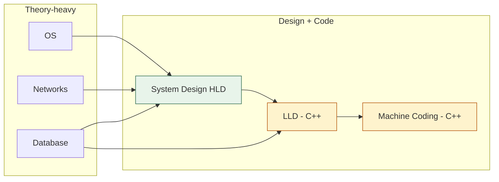
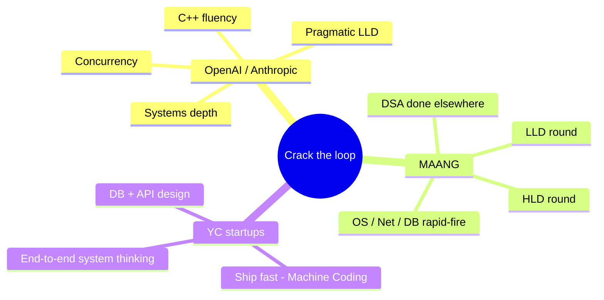

# 🎯 Interview Prep — Master Index (CS Fundamentals)

> Top-quality, **visual-first**, Obsidian-friendly prep for **OpenAI · Anthropic · MAANG · top YC startups**.
> Coding language = **C++**. Har domain ka apna mini-vault hai — same DNA as `AI/AI Development`.

## The 6 domains

| # | Domain | Folder | Type | Start here |
|---|--------|--------|------|-----------|
| 1 | **Operating System** | `Operating System/` | Theory + some code | [[Operating System/Home\|OS Home]] |
| 2 | **Computer Networks** | `Network/` | Theory + sockets | [[Network/Home\|Network Home]] |
| 3 | **Database (DBMS)** | `Database/` | Theory + heavy SQL | [[Database/Home\|DB Home]] |
| 4 | **System Design (HLD)** | `System Design(HLD)/` | Design + case studies | [[System Design(HLD)/Home\|HLD Home]] |
| 5 | **Low Level Design (LLD)** | `LLD/` | **Heavy C++ coding** | [[LLD/Home\|LLD Home]] |
| 6 | **Machine Coding** | `Machine Code/` | **Heavy C++ coding** | [[Machine Code/Home\|Machine Coding Home]] |

## How this vault works (read once)

Same philosophy as your AI vault — proven, so we reuse it:

1. **Visual learner first.** Har module mein `## Visual map` — mermaid + ASCII. Pehle diagram, phir text.
2. **Coach teaches, tum code likhte ho.** `Prompt.md` = Hinglish coach persona. No full code upfront — active recall → exercise → review.
3. **Active recall + spaced repetition** built into every module — kyunki overfitting aur bhoolna dono se ladna hai.
4. **Assignments = starter stub + gaps + passing criteria.** Coding-heavy domains (LLD, Machine Coding) mein actual C++ stub files `problems/` mein.
5. **Redraw challenge** har session end — diagram bina dekhe banao → `NOTES.md → My diagrams`.



## Suggested study loop (per domain)

```
Home.md → LEARNING-PLAN.md (full syllabus) → VISUAL-STUDY-GUIDE.md (master map)
   → modules/00 → 01 → ... (MODULE.md padho, NOTES.md likho)
   → coach agent: @Memory.md @Prompt.md @modules/XX/MODULE.md
   → session end: Redraw challenge + spaced-rep checklist
```

## Per-domain files (identical structure everywhere)

| File | Kya hai |
|------|---------|
| `Home.md` | Vault entry, module table, reading workflow |
| `LEARNING-PLAN.md` | **Full syllabus** — every topic, every assignment, exit criteria, mermaid mind map |
| `VISUAL-STUDY-GUIDE.md` | Master diagrams + spaced-repetition bank |
| `Memory.md` | Coach rules, learner profile, CV→concept hooks |
| `Prompt.md` | Hinglish coach persona (paste into Claude/Cursor) |
| `modules/XX/MODULE.md` | Visual map + topics + assignments + recall bank |
| `modules/XX/NOTES.md` | Tumhari learnings (tum likhoge) |
| `templates/session-entry.md` | Session log template |
| `.cursor/skills/<domain>-coach/SKILL.md` | Cursor coach skill |

## Interview target map



## Progress tracker

- [ ] OS — modules 00–11
- [ ] Network — modules 00–10
- [ ] Database — modules 00–10
- [ ] System Design (HLD) — modules 00–10
- [ ] LLD — modules 00–08 + problems
- [ ] Machine Coding — modules 00–03 + problems

---

> Tip: Yeh poora `Learning/` ek hi Obsidian vault hai — wikilinks sab folders ke beech kaam karte hain. Graph view kholo → 6 clusters dikhenge.

---

## 🖥️ Backend frameworks track
Beyond CS fundamentals, a polyglot backend track lives in **[[Backend/README|Backend/]]** — best-per-language frameworks chosen for AI-infra/platform goals:
**Python → FastAPI** · **Go → Gin** · **Rust → Axum** · **Java → Spring Boot**.
Same 11-module visual-first path each (routing → validation → middleware → DB → auth → concurrency → resilience → testing → observability → deploy → capstone).
