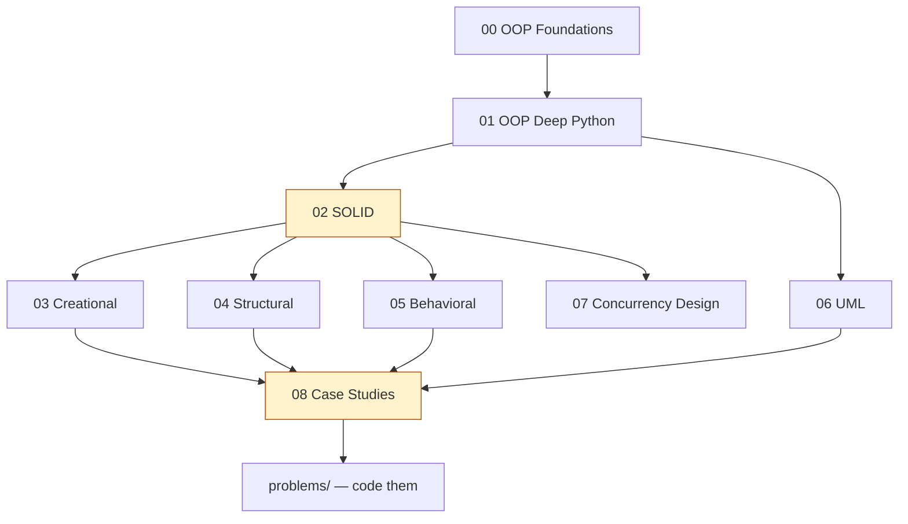

# Low Level Design (LLD) — Home

> LLD vault entry point. **Heavy Python coding.** ← back to [[INTERVIEW-PREP|Master Index]]

## Quick links
| Doc | Kya hai |
|-----|---------|
| [[LLD/Memory\|Memory]] | Coach rules, profile, CV→LLD hooks |
| [[LLD/Prompt\|Prompt]] | Hinglish coach persona |
| [[LLD/LEARNING-PLAN\|LEARNING-PLAN]] | **Full syllabus** — OOP, SOLID, all patterns, case studies |
| [[LLD/VISUAL-STUDY-GUIDE\|VISUAL-STUDY-GUIDE]] | UML + pattern map + spaced-rep |
| [[LLD/problems/README\|Problems index]] 🔥 | Python design problems with starter stubs |

## Modules
| # | Syllabus | Notes | Focus |
|---|----------|-------|-------|
| 00 | [[LLD/modules/00-foundations-oop/MODULE\|Foundations & OOP]] | [[LLD/modules/00-foundations-oop/NOTES\|NOTES]] | Classes, objects, OOP |
| 01 | [[LLD/modules/01-oop-deep-python/MODULE\|OOP Deep (Python)]] | [[LLD/modules/01-oop-deep-python/NOTES\|NOTES]] | Encapsulation→polymorphism |
| 02 | [[LLD/modules/02-solid/MODULE\|SOLID Principles]] 🔥 | [[LLD/modules/02-solid/NOTES\|NOTES]] | 5 principles + violations |
| 03 | [[LLD/modules/03-creational-patterns/MODULE\|Creational Patterns]] | [[LLD/modules/03-creational-patterns/NOTES\|NOTES]] | Singleton, Factory, Builder |
| 04 | [[LLD/modules/04-structural-patterns/MODULE\|Structural Patterns]] | [[LLD/modules/04-structural-patterns/NOTES\|NOTES]] | Adapter, Decorator, Proxy |
| 05 | [[LLD/modules/05-behavioral-patterns/MODULE\|Behavioral Patterns]] | [[LLD/modules/05-behavioral-patterns/NOTES\|NOTES]] | Strategy, Observer, State |
| 06 | [[LLD/modules/06-uml-relationships/MODULE\|UML & Relationships]] | [[LLD/modules/06-uml-relationships/NOTES\|NOTES]] | Class diagrams, assoc/aggr/comp |
| 07 | [[LLD/modules/07-concurrency-design/MODULE\|Concurrency in Design]] | [[LLD/modules/07-concurrency-design/NOTES\|NOTES]] | Thread-safe singleton, locks |
| 08 | [[LLD/modules/08-case-studies/MODULE\|Case Studies]] 🔥 | [[LLD/modules/08-case-studies/NOTES\|NOTES]] | Parking lot, BookMyShow... |

## Reading workflow
1. **00→02 (OOP + SOLID) pakka karo** — sab patterns inhi pe khade hain
2. Patterns: har pattern ka **UML + intent + 1 real use** + khud Python mein likho
3. Module 08 + `problems/`: design problem uthao → requirements → classes → code → test
4. Redraw challenge (class diagram) → `NOTES.md → My diagrams`
5. Coach: `@Memory.md @Prompt.md @modules/XX/MODULE.md`

## Dependency order


## Vault path
```
/Users/vansh/Desktop/Code/Learning/LLD
```
