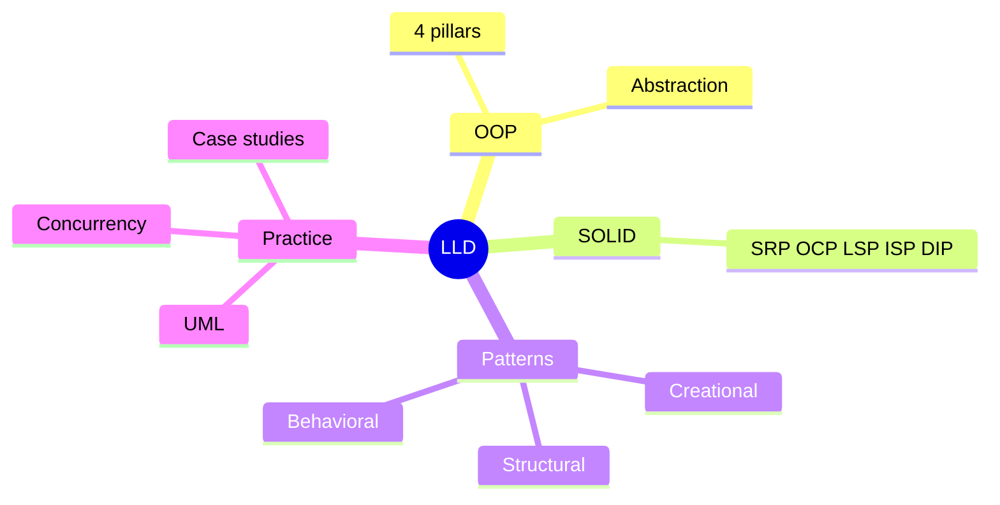
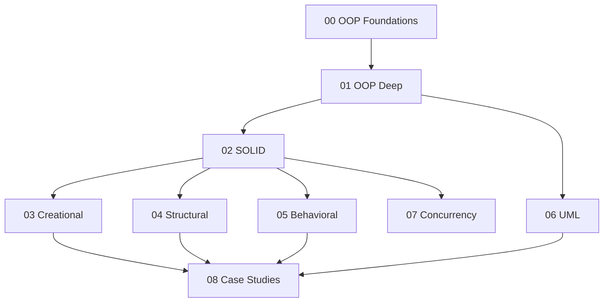

# LLD — Learning Plan (Full Syllabus)

> **Visual learner**: har module `## Visual map` (UML). Start: `@VISUAL-STUDY-GUIDE.md`.
> **No standard pattern/problem left out.** All 23 GoF patterns + 12 case studies (`problems/`).

## Mind map

## Dependency graph

---

## Module 00 — Foundations & OOP
**Topics**: Class vs object; constructor; instance vs class vs static members; `self`; methods; OOP vs procedural; why OOP for LLD; objects as state+behavior.
**Exit**: class vs object; when OOP helps; model a simple entity.

## Module 01 — OOP Deep (C++)
**Topics**: **4 pillars** — Encapsulation (private via `_`/`__`, properties), Abstraction (ABCs, `abc` module), Inheritance (single/multiple, MRO, `super()`), Polymorphism (duck typing, method overriding); composition vs inheritance ("favor composition"); dunder methods (`__eq__`, `__hash__`, `__repr__`, `__lt__`); dataclasses; enums.
**Assignments (C++)**: A1 model a `Shape` hierarchy with abstract `area()`; A2 composition vs inheritance refactor of a `Car`/`Engine`.
**Exit**: 4 pillars with C++ example each; composition vs inheritance — when which; MRO basics.

## Module 02 — SOLID Principles 🔥
**Topics**: **S**RP (one reason to change), **O**CP (open for extension, closed for modification), **L**SP (subtypes substitutable), **I**SP (no fat interfaces), **D**IP (depend on abstractions); each with a violation + fix in C++; code smells (rigidity, fragility, immobility).
**Assignments (C++)**: A1 take a god-class, split per SRP; A2 add a new shape/payment type via OCP (no existing-code edit); A3 fix an LSP violation (Square/Rectangle); A4 DIP — inject an abstraction.
**Exit**: 5 principles + 1 violation+fix each from memory; spot which SOLID a design violates.

## Module 03 — Creational Patterns
**Topics**: **Singleton** (+ thread-safe, why often anti-pattern), **Factory Method**, **Abstract Factory**, **Builder** (telescoping ctor problem), **Prototype**; intent + UML + when-NOT for each.
**Assignments (C++)**: A1 thread-safe Singleton (config); A2 Factory for shapes/payments; A3 Builder for a complex `Pizza`/`HttpRequest`; passing criteria: extensible without editing factory's callers.
**Exit**: each pattern intent + UML; Factory vs Abstract Factory; Builder vs telescoping ctor; Singleton pitfalls.

## Module 04 — Structural Patterns
**Topics**: **Adapter**, **Decorator**, **Facade**, **Composite**, **Proxy**, **Bridge**, **Flyweight**; intent + UML + real use; Decorator vs inheritance; Proxy vs Decorator vs Adapter.
**Assignments (C++)**: A1 Decorator for add-on pricing (coffee/notification); A2 Adapter for a legacy interface; A3 Composite for a file-system tree; passing criteria: new types added without breaking clients.
**Exit**: each pattern intent + UML; Decorator vs Proxy vs Adapter difference; Composite use case.

## Module 05 — Behavioral Patterns
**Topics**: **Strategy**, **Observer**, **State**, **Command**, **Template Method**, **Iterator**, **Chain of Responsibility**, **Mediator**, **Memento**, **Visitor**, **Interpreter** (brief); intent + UML + when-NOT.
**Assignments (C++)**: A1 Strategy for pluggable payment/sort; A2 Observer for an event/notification system; A3 State for an order/vending state machine; A4 Chain of Responsibility for request handlers/approval; passing criteria: add a new strategy/state/handler without editing existing ones (OCP).
**Exit**: each pattern intent + UML; Strategy vs State (same structure, different intent); Observer push vs pull; CoR use case.

## Module 06 — UML & Relationships
**Topics**: Class diagram notation; **association vs aggregation vs composition** (vs dependency); multiplicity; inheritance/realization arrows; sequence diagrams (brief); reading + drawing UML fast in an interview.
**Assignments**: A1 draw class diagram for a library system; A2 distinguish aggregation vs composition with examples.
**Exit**: association/aggregation/composition arrows + meaning; draw a class diagram from requirements.

## Module 07 — Concurrency in Design
**Topics**: Thread-safe Singleton (double-checked / module-level); immutable objects; thread-safe collections; producer-consumer in design; designing for concurrency (avoid shared mutable state); C++ memory model & data races (threads truly parallel); locks in a design (bank account, parking lot ticketing).
**Assignments (C++)**: A1 thread-safe Singleton + test under threads; A2 thread-safe seat-booking (no double-book).
**Exit**: thread-safe singleton approaches; where to put locks in a design; immutability benefit.

## Module 08 — Case Studies 🔥 (design + code in `problems/`)
For each: requirements → core entities → class diagram → identify patterns → starter stub → full code → tests → extensibility discussion.
**Problems** (see `@problems/README.md`):
1. **Parking Lot** (Strategy for pricing, Factory for spots)
2. **Elevator System** (State, scheduling strategy)
3. **Vending Machine** (State pattern)
4. **Splitwise** (expense split strategies, balance graph)
5. **BookMyShow** (seat locking/concurrency, booking)
6. **Tic-Tac-Toe** (board, win-check, players)
7. **Snake & Ladder** (board, dice, players)
8. **Library Management** (membership, catalog, fines)
9. **ATM** (State pattern, transactions)
10. **Logging Framework** (Chain of Responsibility, levels, appenders)
11. **Chess** (pieces polymorphism, move validation)
12. **Food Delivery** (orders, restaurants, assignment strategy)
**Exit**: design + code any 6+ end-to-end; defend pattern choices + extensibility.

---

## Weekly rhythm
| Day | Focus |
|-----|-------|
| Mon–Tue | Principle/pattern + recall + UML |
| Wed–Thu | Code a pattern / a problem |
| Fri | Extensibility review + NOTES |
| Sat | Spaced recall (SOLID, intents) |
| Sun | Buffer / a full problem |

## Spaced repetition checklist (har 2 modules)
- [ ] 5 SOLID + violation each
- [ ] Strategy vs State
- [ ] Decorator vs Proxy vs Adapter
- [ ] Factory vs Abstract Factory vs Builder
- [ ] Aggregation vs composition
- [ ] Observer push vs pull
- [ ] Thread-safe singleton
