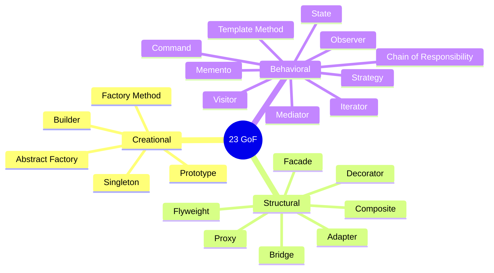
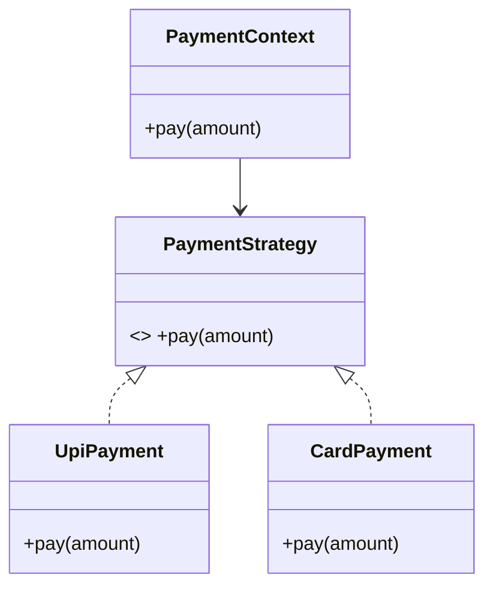

# LLD Visual Study Guide — Vansh

> Visual learner master sheet. UML pehle, redraw se recall.

## SOLID (MEMORIZE)
```
S  Single Responsibility — ek class, ek reason to change
O  Open/Closed          — extension ke liye open, modification ke liye closed
L  Liskov Substitution  — subtype parent ki jagah chal jaaye, contract na toote
I  Interface Segregation— chhote focused interfaces, fat nahi
D  Dependency Inversion — abstraction pe depend karo, concrete pe nahi
```

## GoF pattern map


## Confusing pairs (interview gold)
```
Strategy vs State : same UML; Strategy = pick algorithm, State = behavior changes with internal state (+ transitions)
Decorator vs Proxy: Decorator adds behavior; Proxy controls access (lazy/auth/remote)
Adapter vs Decorator: Adapter changes interface; Decorator keeps interface, adds behavior
Factory Method vs Abstract Factory: one product vs families of products
```

## UML relationships
```
Association  (—►)  : "uses-a"        (Driver — Car)
Aggregation  (◇—)  : "has-a", weak    (Team ◇— Player; player survives team)
Composition  (◆—)  : "owns-a", strong (House ◆— Room; room dies with house)
Inheritance  (▷—)  : "is-a"           (Dog ▷— Animal)
```

## Example: Strategy (mermaid)


## CV → LLD bridge
```
Payment fallback cascade ──► Strategy / Chain of Responsibility
Refund state machine     ──► State pattern
Order types              ──► Factory + polymorphism
Multi-channel notify     ──► Observer / Strategy
Config singleton         ──► Singleton (thread-safe)
Pluggable recon          ──► Strategy + Open/Closed
```

## Spaced-rep recall bank
1. 5 SOLID + 1 violation each?
2. Strategy vs State?
3. Decorator vs Proxy vs Adapter?
4. Aggregation vs composition?
5. Factory Method vs Abstract Factory?
6. When NOT to use a pattern (overengineering)?
