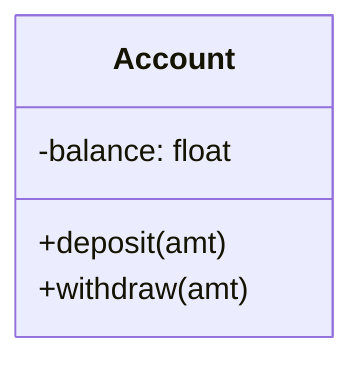

# Module 00 — Foundations & OOP

> **Agent spawn**: `@Memory.md` + `@Prompt.md` + this file + `@NOTES.md`
> **Nav**: Next → [01 OOP Deep (Python)](../01-oop-deep-python/MODULE.md)

## At a glance
| | |
|---|---|
| Prerequisites | Python basics |
| Duration | ~1 session |
| Exit test | Class vs object + when OOP helps |

## Visual map

```
Class  = blueprint (Account)
Object = instance (my_account = Account())
Object = state (data) + behavior (methods)
```
**Mental model**: OOP = real-world cheezon ko objects (state + behavior) ki tarah model karo. LLD = "is system ko classes mein kaise todun taaki clean + extensible ho". Sab patterns OOP pe khade hain.

**Redraw challenge**: A simple class diagram for an entity you pick.

## Objectives
1. Class vs object; constructor; `self`
2. Instance vs class vs static members
3. OOP vs procedural; why OOP for LLD

## Topics
- Class, object, instance; `__init__`, `self`
- Instance vs class (`@classmethod`) vs static (`@staticmethod`) members
- Methods; objects as state + behavior
- OOP vs procedural; when OOP pays off

## Assignments
| # | Task | Passing criteria |
|---|------|------------------|
| A1 | Model `BankAccount` (balance, deposit, withdraw) | Encapsulated, no negative balance |
| A2 | Add a class-level counter of total accounts | Correct via classmethod |

## Active recall bank
1. Class vs object — analogy?
2. instance vs static method — kab kya?
3. OOP kab procedural se behtar?

## Progress checklist
- [ ] Class vs object from memory
- [ ] A1, A2 coded
- [ ] NOTES.md updated
