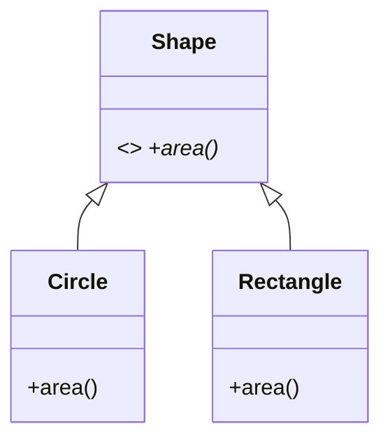

# Module 01 — OOP Deep (C++)

> **Agent spawn**: `@Memory.md` + `@Prompt.md` + this file + `@NOTES.md`
> **Nav**: ← [00 Foundations](../00-foundations-oop/MODULE.md) · Next → [02 SOLID](../02-solid/MODULE.md)

## At a glance
| | |
|---|---|
| Prerequisites | 00 |
| Duration | ~1–2 sessions |
| Exit test | 4 pillars + composition vs inheritance |

## Visual map

```
4 PILLARS:
  Encapsulation : data + methods bundle, hide internals (_ , __, @property)
  Abstraction   : essential expose, detail hide (ABC, abstractmethod)
  Inheritance   : is-a reuse (super(), MRO)
  Polymorphism  : same call, different behavior (override, duck typing)
favor COMPOSITION over inheritance (has-a > is-a) when reuse without tight coupling
```
**Mental model**: 4 pillars LLD ki neenv. Polymorphism = "interface same, kaam alag" → if-else hatata. Composition over inheritance = flexible, kam coupling (inheritance rigid hota).

**Redraw challenge**: Shape hierarchy + composition-vs-inheritance example.

## Objectives
1. Encapsulation, Abstraction, Inheritance, Polymorphism in C++
2. Composition vs inheritance
3. Dunder methods; dataclasses; enums

## Topics
- Encapsulation: `_protected`, `__private`, `@property`
- Abstraction: `abc.ABC`, `@abstractmethod`
- Inheritance: single/multiple, MRO, `super()`
- Polymorphism: overriding, duck typing
- Composition vs inheritance ("favor composition")
- Dunders: `__eq__`, `__hash__`, `__repr__`, `__lt__`; `@dataclass`; `Enum`

## Assignments
| # | Task | Passing criteria |
|---|------|------------------|
| A1 | `Shape` ABC + `Circle`/`Rectangle` with `area()` | Polymorphic `total_area(shapes)` works |
| A2 | Refactor `Car` to compose `Engine` (not inherit) | Swap engine without changing Car interface |

## Active recall bank
1. 4 pillars + C++ mechanism each?
2. Composition over inheritance — kyun?
3. `__eq__` ke saath `__hash__` kyun?
4. Duck typing kya?

## Progress checklist
- [ ] 4 pillars from memory
- [ ] A1, A2 coded
- [ ] NOTES.md updated
