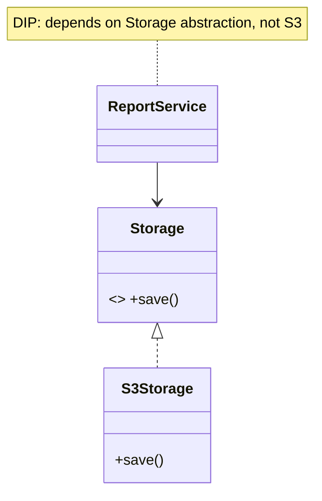

# Module 02 — SOLID Principles 🔥

> **Agent spawn**: `@Memory.md` + `@Prompt.md` + this file + `@NOTES.md`
> **Nav**: ← [01 OOP Deep](../01-oop-deep-python/MODULE.md) · Next → [03 Creational Patterns](../03-creational-patterns/MODULE.md)

## At a glance
| | |
|---|---|
| Prerequisites | 01 |
| Duration | ~2 sessions |
| Exit test | 5 principles + 1 violation+fix each from memory |

## Visual map
```
S  Single Responsibility — ek class, ek reason to change
O  Open/Closed          — naya behavior add karo bina purana code chhede
L  Liskov Substitution  — child parent ki jagah, contract na toote
I  Interface Segregation— chhote interfaces; client ko bekaar methods na milein
D  Dependency Inversion — high-level abstraction pe depend, concrete pe nahi
```

**Mental model**: SOLID = maintainable + extensible code ke 5 rule. Interview mein design dete waqt bolo "yeh OCP follow karta", aur galat design mein "yeh SRP todta". Har pattern in principles ko serve karta.

**Redraw challenge**: 5 SOLID one-liners + DIP class diagram.

## Objectives
1. Each SOLID principle precisely
2. Violation + fix for each in C++
3. Spotting which principle a design breaks

## Topics
- SRP, OCP, LSP, ISP, DIP — definition + smell + fix
- Code smells: rigidity, fragility, immobility
- SOLID ↔ patterns connection

## Assignments
| # | Task | Passing criteria |
|---|------|------------------|
| A1 | Split a god-class per SRP | Each class one responsibility, tests pass |
| A2 | Add new payment type via OCP | Zero edits to existing classes |
| A3 | Fix Square/Rectangle LSP violation | No broken contract |
| A4 | Apply DIP — inject a storage abstraction | High-level module unaware of concrete |

## Active recall bank
1. OCP — "closed for modification" kaise + "open for extension"?
2. LSP violation ka classic example?
3. ISP fat interface problem?
4. DIP — kaun kis pe depend kare?

## Progress checklist
- [ ] 5 principles + violation each from memory
- [ ] A1–A4 coded
- [ ] NOTES.md updated

## Reference code (study material)

Canonical runnable C++ in [`LLD/examples/solid/`](../../examples/solid/) — each SOLID principle: ❌ violation + ✅ fix.
Pehle khud likhne ki koshish karo (struggle-first), phir reference se compare. Build: `g++ -std=c++17 file.cpp -o ex && ./ex`.
