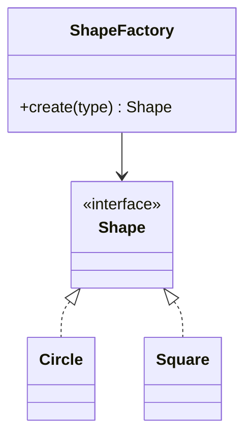

# Module 03 — Creational Patterns

> **Agent spawn**: `@Memory.md` + `@Prompt.md` + this file + `@NOTES.md`
> **Nav**: ← [02 SOLID](../02-solid/MODULE.md) · Next → [04 Structural Patterns](../04-structural-patterns/MODULE.md)

## At a glance
| | |
|---|---|
| Prerequisites | 02 |
| Duration | ~2 sessions |
| Exit test | Each pattern intent + UML + Factory vs Abstract Factory vs Builder |

## Visual map

```
Singleton        : ek hi instance (config, logger) — thread-safe banao, often anti-pattern
Factory Method   : creation ko subclass/function pe defer
Abstract Factory : families of related objects
Builder          : step-by-step complex object (telescoping ctor se bacho)
Prototype        : clone an existing object
```
**Mental model**: Creational = "object kaise banayein" ko abstract karte hain taaki client `new` se decouple ho jaaye → OCP. Factory = ek product; Abstract Factory = product family; Builder = bahut optional params.

**Redraw challenge**: Factory UML + when each creational pattern.

## Objectives
1. Singleton (+ thread-safe + pitfalls)
2. Factory Method vs Abstract Factory
3. Builder; Prototype
4. When NOT to use (overengineering)

## Topics
- Singleton: module-level, double-checked locking, why often anti-pattern
- Factory Method; Abstract Factory (families)
- Builder (telescoping constructor problem)
- Prototype (clone)

## Assignments
| # | Task | Passing criteria |
|---|------|------------------|
| A1 | Thread-safe Singleton config | One instance under threads |
| A2 | Factory for shapes/payment methods | New type added without editing callers |
| A3 | Builder for `Pizza`/`HttpRequest` | Optional fields, readable, immutable result |

## Active recall bank
1. Factory Method vs Abstract Factory?
2. Builder telescoping ctor kaise solve karta?
3. Singleton anti-pattern kyun maana jaata?

## Progress checklist
- [ ] Each pattern intent + UML from memory
- [ ] A1–A3 coded
- [ ] NOTES.md updated
