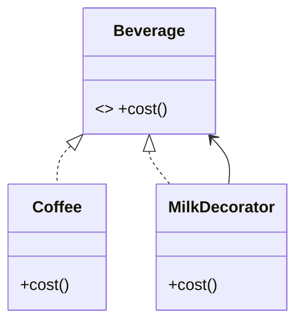

# Module 04 — Structural Patterns

> **Agent spawn**: `@Memory.md` + `@Prompt.md` + this file + `@NOTES.md`
> **Nav**: ← [03 Creational Patterns](../03-creational-patterns/MODULE.md) · Next → [05 Behavioral Patterns](../05-behavioral-patterns/MODULE.md)

## At a glance
| | |
|---|---|
| Prerequisites | 02 |
| Duration | ~2 sessions |
| Exit test | Each intent + UML + Decorator vs Proxy vs Adapter |

## Visual map

```
Adapter   : interface badlo (legacy → expected)
Decorator : behavior add karo, interface same (wrap)
Facade    : complex subsystem ke aage simple door
Composite : tree (part-whole), uniform treat
Proxy     : access control (lazy/auth/remote/cache)
Bridge    : abstraction + implementation alag axes
Flyweight : shared state, memory bachao
```
**Mental model**: Structural = objects ko jodne/wrap karne ke tareeke. Key confusion: Adapter interface badalta, Decorator behavior add karta (interface same), Proxy access control karta.

**Redraw challenge**: Decorator UML + the Adapter/Decorator/Proxy difference.

## Objectives
1. Adapter, Decorator, Facade, Composite
2. Proxy, Bridge, Flyweight
3. Decorator vs Proxy vs Adapter

## Topics
- Adapter; Decorator (vs inheritance); Facade; Composite (tree)
- Proxy (virtual/protection/remote); Bridge; Flyweight

## Assignments
| # | Task | Passing criteria |
|---|------|------------------|
| A1 | Decorator for add-on pricing (coffee/notification) | Stack decorators, cost correct |
| A2 | Adapter for a legacy logger/payment API | Client uses target interface unchanged |
| A3 | Composite for a file-system tree (size sum) | Leaf + composite uniform |

## Active recall bank
1. Decorator vs Proxy vs Adapter?
2. Composite kab (tree/part-whole)?
3. Flyweight memory kaise bachata?

## Progress checklist
- [ ] Each intent + UML from memory
- [ ] A1–A3 coded
- [ ] NOTES.md updated
