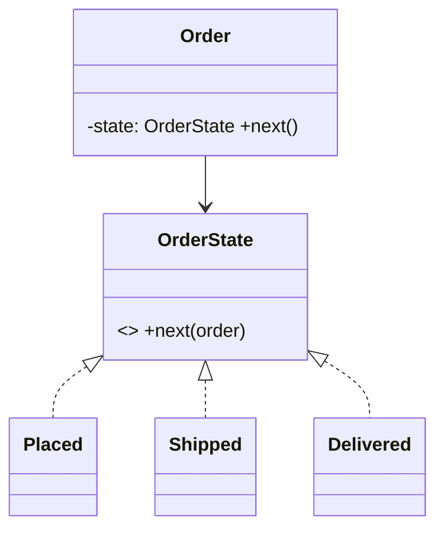

# Module 05 — Behavioral Patterns

> **Agent spawn**: `@Memory.md` + `@Prompt.md` + this file + `@NOTES.md`
> **Nav**: ← [04 Structural Patterns](../04-structural-patterns/MODULE.md) · Next → [06 UML & Relationships](../06-uml-relationships/MODULE.md)

## At a glance
| | |
|---|---|
| Prerequisites | 02 |
| Duration | ~2–3 sessions |
| Exit test | Each intent + UML + Strategy vs State |

## Visual map

```
Strategy  : interchangeable algorithms (pick one)
State     : behavior changes with internal state (+ transitions)  ← same UML as Strategy!
Observer  : 1-to-many notify on change (pub-sub)
Command   : request as object (undo/redo, queue)
Template  : algorithm skeleton, steps overridable
Chain of Responsibility: pass request along handlers
Iterator / Mediator / Memento / Visitor
```
**Mental model**: Behavioral = objects ke beech responsibility + communication. Star pair: Strategy vs State (UML same, intent alag — Strategy algo chunta, State khud transition karta). CV: refund chain = State, fallback = CoR/Strategy.

**Redraw challenge**: State pattern UML + Strategy-vs-State difference.

## Objectives
1. Strategy, Observer, State, Command
2. Template Method, Chain of Responsibility
3. Iterator, Mediator, Memento, Visitor (overview)
4. Strategy vs State

## Topics
- Strategy; Observer (push/pull); State; Command (undo)
- Template Method; Chain of Responsibility
- Iterator, Mediator, Memento, Visitor (brief)

## Assignments
| # | Task | Passing criteria |
|---|------|------------------|
| A1 | Strategy for pluggable payment/sort | Swap strategy at runtime, OCP |
| A2 | Observer for event/notification | Multiple subscribers notified |
| A3 | State for order/vending machine | Valid transitions only |
| A4 | Chain of Responsibility for approval/handlers | Request flows till handled |

## Active recall bank
1. Strategy vs State — same UML, kya farak?
2. Observer push vs pull?
3. Command undo kaise enable karta?
4. CoR kab useful?

## Progress checklist
- [ ] Each intent + UML from memory
- [ ] A1–A4 coded
- [ ] NOTES.md updated

## Reference code (study material)

Canonical runnable C++ in [`LLD/examples/patterns/behavioral/`](../../examples/patterns/behavioral/) — strategy, observer, state, command, template_method, iterator, chain_of_responsibility, mediator, memento, visitor.
Pehle khud likhne ki koshish karo (struggle-first), phir reference se compare. Build: `g++ -std=c++17 file.cpp -o ex && ./ex`.
