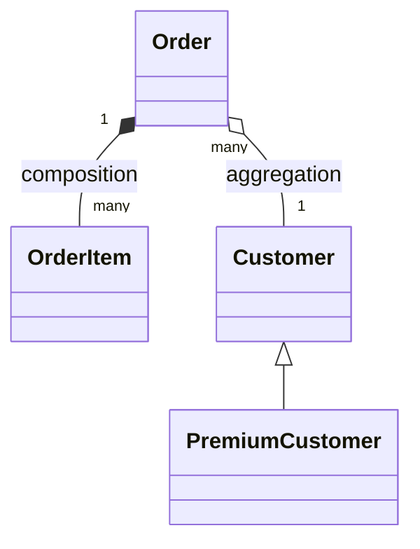

# Module 06 — UML & Relationships

> **Agent spawn**: `@Memory.md` + `@Prompt.md` + this file + `@NOTES.md`
> **Nav**: ← [05 Behavioral Patterns](../05-behavioral-patterns/MODULE.md) · Next → [07 Concurrency in Design](../07-concurrency-design/MODULE.md)

## At a glance
| | |
|---|---|
| Prerequisites | 01 |
| Duration | ~1 session |
| Exit test | Association/aggregation/composition + draw from requirements |

## Visual map
```
Association  A ──► B    "uses-a"        (loose link)
Aggregation  A ◇── B    "has-a" weak     (B lives without A) Team-Player
Composition  A ◆── B    "owns-a" strong  (B dies with A)     House-Room
Inheritance  A ──▷ B    "is-a"
Dependency   A ┄─► B    "depends-on" (param/local use)
```

**Mental model**: Interview mein fast UML zaroori. Aggregation vs composition = lifecycle: composition mein parent gaya toh child bhi gaya (Order→OrderItem), aggregation mein nahi (Team→Player). Yeh confusion sabse common.

**Redraw challenge**: 4 relationship arrows + 1 example each.

## Objectives
1. Class diagram notation
2. Association vs aggregation vs composition vs dependency
3. Multiplicity; draw fast from requirements

## Topics
- Class box (name, attributes, methods, visibility)
- Association, aggregation, composition, dependency, inheritance, realization
- Multiplicity (1, *, 0..1, 1..*)
- Sequence diagram (brief)

## Assignments
| # | Task | Passing criteria |
|---|------|------------------|
| A1 | Class diagram for a library system | Correct relationships + multiplicity |
| A2 | Aggregation vs composition: 3 examples each | Lifecycle reasoning correct |

## Active recall bank
1. Aggregation vs composition — lifecycle?
2. Association vs dependency?
3. Multiplicity notation?

## Progress checklist
- [ ] 4 relationships from memory
- [ ] A1, A2 done
- [ ] NOTES.md updated
