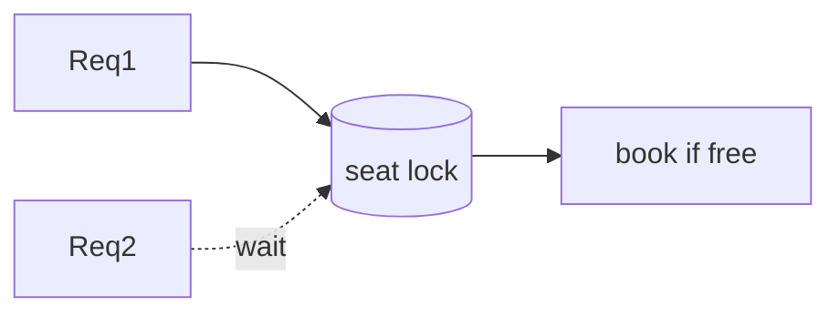

# Module 07 — Concurrency in Design

> **Agent spawn**: `@Memory.md` + `@Prompt.md` + this file + `@NOTES.md`
> **Nav**: ← [06 UML & Relationships](../06-uml-relationships/MODULE.md) · Next → [08 Case Studies](../08-case-studies/MODULE.md)

## At a glance
| | |
|---|---|
| Prerequisites | 02 · (OS module 03 helps) |
| Duration | ~1 session |
| Exit test | Thread-safe singleton + where locks go in a design |

## Visual map
```
Seat booking race:
  T1 check seat free ─┐
  T2 check seat free ─┤ both book SAME seat → double-booked!
fix: lock per seat (or atomic compare-and-set / DB row lock)

Thread-safe singleton: module-level instance OR lock + double-check
Prefer IMMUTABLE objects + no shared mutable state
```

**Mental model**: LLD mein bhi concurrency aata (BookMyShow seat, parking ticket). Rule: shared mutable state minimize karo; jahan zaroori wahan fine-grained lock. CV: tumne matching engine mein concurrency handle ki — wahi yahan.

**Redraw challenge**: seat-booking race + lock fix.

## Objectives
1. Thread-safe Singleton
2. Immutability + thread-safe collections
3. Where to put locks in a design
4. Data races & C++ memory model (threads truly parallel)

## Topics
- Thread-safe Singleton (module-level, double-checked)
- Immutable objects; thread-safe access (`std::mutex`-guarded containers, `std::atomic`)
- Designing to avoid shared mutable state
- Locks in design: bank account, seat booking, parking ticket
- C++ true parallelism → shared state guard karo (no GIL safety net)

## Assignments
| # | Task | Passing criteria |
|---|------|------------------|
| A1 | Thread-safe Singleton + test under threads | Exactly one instance |
| A2 | Thread-safe seat booking | No double-book under concurrent requests |

## Active recall bank
1. Thread-safe singleton 2 approaches?
2. Design mein lock kahan + kitna fine-grained?
3. Immutability concurrency mein kaise help karti?

## Progress checklist
- [ ] Thread-safe patterns from memory
- [ ] A1, A2 coded
- [ ] NOTES.md updated
