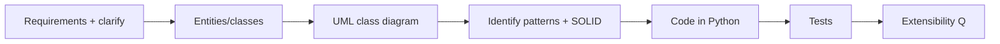

# Module 08 — Case Studies 🔥

> **Agent spawn**: `@Memory.md` + `@Prompt.md` + this file + `@NOTES.md`
> **Nav**: ← [07 Concurrency in Design](../07-concurrency-design/MODULE.md) · Problems → [[LLD/problems/README|problems/]]

## At a glance
| | |
|---|---|
| Prerequisites | 00–07 |
| Duration | ~6+ sessions (1 per problem) |
| Exit test | Design + code any 6+ end-to-end, defend patterns |

## Visual map

**Mental model**: LLD interview ka asli round. Process har baar: requirements clarify → entities → class diagram → patterns chuno (justify) → code → test → "naya feature aaye toh kitna change". Pattern recognize karo: state machines (vending/ATM/order) → State; pluggable rules (pricing/split) → Strategy; handler chains (logging/approval) → CoR.

**Redraw challenge**: For each problem, the class diagram from memory.

## Problems (code in `problems/<name>/` — see `@problems/README.md`)
| # | Problem | Key patterns | Twist |
|---|---------|--------------|-------|
| 1 | Parking Lot | Strategy (pricing), Factory (spot) | multiple vehicle/spot types |
| 2 | Elevator System | State, scheduling strategy | multi-lift dispatch |
| 3 | Vending Machine | State | refund, inventory |
| 4 | Splitwise | Strategy (split), graph | simplify debts |
| 5 | BookMyShow | concurrency (seat lock) | no double-booking |
| 6 | Tic-Tac-Toe | Strategy (win-check) | NxN generalize |
| 7 | Snake & Ladder | composition, dice | multiplayer |
| 8 | Library Management | — | fines, reservations |
| 9 | ATM | State | auth, dispense algorithm |
| 10 | Logging Framework | Chain of Responsibility | levels, appenders |
| 11 | Chess | polymorphism (pieces) | move validation |
| 12 | Food Delivery | Strategy (assignment) | rider matching |

## Assignments
| # | Task | Passing criteria |
|---|------|------------------|
| A1 | Design + code 6+ problems end-to-end | Working code + tests + patterns justified |
| A2 | For 2 problems, add a new requirement live | Minimal change (OCP defended) |

## Active recall bank
1. Vending machine kaunsa pattern, kyun?
2. BookMyShow double-booking kaise rokoge?
3. Splitwise debts simplify kaise?
4. Parking lot extensible pricing kaise?

## Progress checklist
- [ ] 6+ problems designed + coded
- [ ] **LLD spaced-rep checklist** (LEARNING-PLAN) full pass
- [ ] NOTES.md updated
