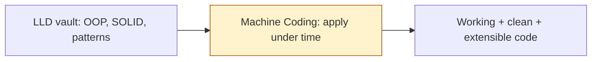

# Machine Coding — Home

> Machine-coding round vault. **Heavy C++ coding, time-boxed.** ← back to [[INTERVIEW-PREP|Master Index]]

## Quick links
| Doc | Kya hai |
|-----|---------|
| [[Machine Code/Memory\|Memory]] | Coach rules, profile, scoring rubric |
| [[Machine Code/Prompt\|Prompt]] | Hinglish coach persona |
| [[Machine Code/LEARNING-PLAN\|LEARNING-PLAN]] | **Full syllabus** + problem bank |
| [[Machine Code/VISUAL-STUDY-GUIDE\|VISUAL-STUDY-GUIDE]] | Approach map + rubric + spaced-rep |
| [[Machine Code/problems/README\|Problems index]] 🔥 | Timed C++ problems with stubs |

## What is a machine-coding round?
60–120 min mein ek **working, runnable, extensible** program likhna — clean code, OOP, tests/demo, edge cases. LLD ka practical exam. **In-memory** (no DB/UI usually). Score: working + clean + extensible + tested.

## Modules
| # | Syllabus | Notes | Focus |
|---|----------|-------|-------|
| 00 | [[Machine Code/modules/00-foundations/MODULE\|Foundations]] | [[Machine Code/modules/00-foundations/NOTES\|NOTES]] | What/why, format, mindset |
| 01 | [[Machine Code/modules/01-approach-rubric/MODULE\|Approach & Rubric]] 🔥 | [[Machine Code/modules/01-approach-rubric/NOTES\|NOTES]] | 90-min playbook, scoring |
| 02 | [[Machine Code/modules/02-building-blocks/MODULE\|Building Blocks]] | [[Machine Code/modules/02-building-blocks/NOTES\|NOTES]] | In-memory store, concurrency |
| 03 | [[Machine Code/modules/03-clean-code-testing/MODULE\|Clean Code & Testing]] | [[Machine Code/modules/03-clean-code-testing/NOTES\|NOTES]] | Readability, unittest |

## Reading workflow
1. **Module 01 (approach) internalize** — har round isi playbook se
2. Module 02–03: reusable building blocks + clean-code habits
3. `problems/`: **timer laga ke** solve karo → demo/tests pass
4. Self-score via rubric (module 01) → `NOTES.md`
5. Coach: `@Memory.md @Prompt.md @modules/XX/MODULE.md`

## Relationship to LLD


## Vault path
```
/Users/vansh/Desktop/Code/Learning/Machine Code
```
