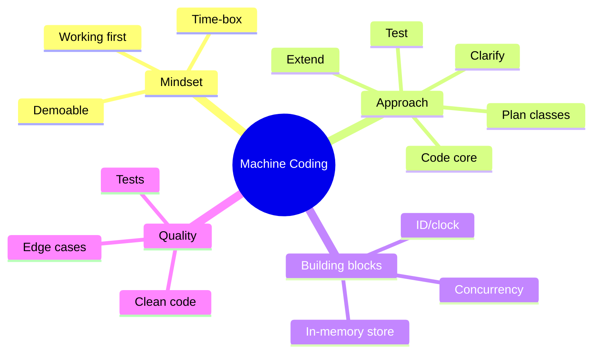

# Machine Coding — Learning Plan (Full Syllabus)

> **Visual learner**: har module `## Visual map`. Start: `@VISUAL-STUDY-GUIDE.md`.
> **Prereq**: `LLD/` vault (OOP, SOLID, patterns). Yahan unko **time-box** mein apply karte hain.

## Mind map

---

## Module 00 — Foundations
**Topics**: What a machine-coding round is (working runnable program, usually in-memory, 60–120 min); how it differs from DSA (no single right answer; design + code quality matter) and from LLD (you actually ship code); what interviewers evaluate; common formats (single problem, extend-an-existing-codebase).
**Exit**: explain the round + what's scored; in-memory mindset.

## Module 01 — Approach & Rubric 🔥
**Topics**: The playbook — (1) clarify requirements + list features by priority (MUST vs NICE), (2) 5–10 min design: entities, interfaces, pick patterns, (3) code the **happy path of the core feature first** (something demoable early), (4) add features incrementally, (5) tests/demo, (6) edge cases + refactor; time-boxing; never leave it non-running; commenting assumptions; the scoring rubric (Working/Clean/Design/Extensible/Tested/Edge).
**Assignments**: A1 take any problem, produce only the 10-min plan (entities + interfaces + feature priority); A2 self-score a past attempt on the rubric.
**Exit**: recite the playbook + rubric; turn requirements into a prioritized feature list + class sketch fast.

## Module 02 — Building Blocks (reusable)
**Topics**: In-memory data store patterns (dict-backed repository, indexes); ID generation (counter, uuid); clock injection (for testability of time-based logic); enums for states; the Repository pattern; in-memory pub/sub; thread-safety (`threading.Lock`, `queue.Queue`) when concurrency asked; pluggable strategies (recall from LLD). CV hooks: in-memory matching engine, token-bucket limiter, queue workers.
**Assignments (Python)**: A1 a generic in-memory `Repository[T]` with add/get/query (stub); A2 an injectable `Clock` + a TTL cache using it.
**Exit**: spin up an in-memory store + indexes fast; inject a clock for time logic; know when to add a lock.

## Module 03 — Clean Code & Testing
**Topics**: Readable naming, small functions, no deep nesting, early returns; separation (model vs service vs IO); meaningful errors/exceptions; `unittest`/`pytest` basics; writing 3–5 high-value tests fast; a runnable `if __name__ == "__main__"` demo; what to NOT over-engineer under time pressure.
**Assignments (Python)**: A1 refactor a messy snippet for readability; A2 write a minimal `unittest` suite for one `problems/` solution.
**Exit**: write clean, tested, runnable code under time; know the over-engineering line.

---

## Problem bank (`problems/` — TIMED, Python)
| # | Problem | Target time | Key idea |
|---|---------|-------------|----------|
| 1 | LRU Cache | 30 min | dict + doubly linked list / OrderedDict |
| 2 | LFU Cache | 45 min | freq buckets |
| 3 | Rate Limiter | 30 min | token bucket / sliding window (CV) |
| 4 | In-memory KV store | 45 min | dict, TTL, optional transactions |
| 5 | In-memory SQL (filter/select) | 60 min | tables, where, order, limit |
| 6 | Task Scheduler | 45 min | priority queue / time-wheel |
| 7 | Logging Library | 30 min | levels + appenders (CoR) |
| 8 | Calendar / Meeting Scheduler | 45 min | interval overlap, rooms |
| 9 | In-memory File System | 60 min | tree, paths, ls/mkdir/cat |
| 10 | Snake & Ladder | 30 min | board + dice (also in LLD) |
| 11 | Tic-Tac-Toe | 30 min | NxN win-check |
| 12 | Notification Service | 45 min | channels + retry + dedup (CV: outbox) |

**Drill**: each problem with a real timer → run demo/tests → self-score on rubric → note where time leaked.

## Weekly rhythm
| Day | Focus |
|-----|-------|
| Mon | Approach/building-block + recall |
| Tue–Thu | 1 timed problem/day → self-score |
| Fri | Refactor + tests + NOTES |
| Sat | Re-attempt a weak problem (spaced) |
| Sun | Buffer / full 90-min mock |

## Spaced repetition checklist (har 2 problems)
- [ ] The playbook (6 steps) + rubric
- [ ] In-memory repository pattern
- [ ] LRU in O(1)
- [ ] Token-bucket rate limiter
- [ ] When to add a lock
- [ ] Minimal test in 5 min
