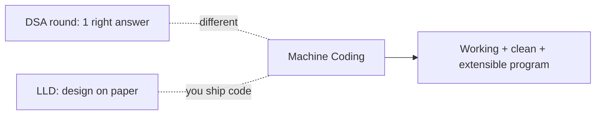

# Module 00 — Machine Coding Foundations

> **Agent spawn**: `@Memory.md` + `@Prompt.md` + this file + `@NOTES.md`
> **Nav**: Next → [01 Approach & Rubric](../01-approach-rubric/MODULE.md)

## At a glance
| | |
|---|---|
| Prerequisites | LLD vault basics |
| Duration | ~1 session |
| Exit test | Explain the round + what's scored |

## Visual map

**Mental model**: Machine coding = "yeh chhota system 90 min mein chalta hua bana ke dikhao". Usually in-memory (no DB/UI). DSA se alag: ek perfect answer nahi — design + code quality matter. LLD se alag: tum asli code ship karte ho.

**Redraw challenge**: DSA vs LLD vs Machine-coding triangle.

## Objectives
1. What the round is + formats
2. How it differs from DSA & LLD
3. What interviewers evaluate
4. In-memory mindset

## Topics
- The round: working runnable program, in-memory, 60–120 min
- Formats: single problem vs extend-existing-codebase
- Evaluation: working, clean, design, extensible, tested
- Why in-memory (focus on design, not infra)

## Assignments
| # | Task | Passing criteria |
|---|------|------------------|
| A1 | Write what you'd be scored on (your own words) | Matches rubric dimensions |

## Active recall bank
1. Machine coding DSA se kaise alag?
2. In-memory kyun usually?
3. 4 cheezein jo score hoti hain?

## Progress checklist
- [ ] Round + scoring understood
- [ ] NOTES.md updated
