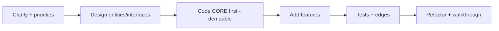

# Module 01 — Approach & Rubric 🔥

> **Agent spawn**: `@Memory.md` + `@Prompt.md` + this file + `@NOTES.md`
> **Nav**: ← [00 Foundations](../00-foundations/MODULE.md) · Next → [02 Building Blocks](../02-building-blocks/MODULE.md)

## At a glance
| | |
|---|---|
| Prerequisites | 00 |
| Duration | ~1–2 sessions |
| Exit test | Recite playbook + rubric; prioritize features fast |

## Visual map

```
RUBRIC: Working | Clean | OOP-Design | Extensible | Tested | Edge-cases
RULE 1: runnable core EARLY (working > elegant-unfinished)
RULE 2: MUST features before NICE
RULE 3: assumptions bol + comment karo
```
**Mental model**: Sabse badi galti = poora time perfect design sochna aur kuch chalega hi nahi. Pehle core happy-path chalao (demoable), phir layer karo. Time-box har phase. Yeh playbook har problem pe same.

**Redraw challenge**: 6-step playbook + 6-dimension rubric.

## Objectives
1. The 6-step playbook
2. Feature prioritization (MUST vs NICE)
3. Time-boxing
4. The scoring rubric (self-assess)

## Topics
- Playbook: clarify → design → code core → add features → test → refactor
- MUST vs NICE prioritization
- Time allocation per phase (90-min template)
- Never leave it non-running; comment assumptions
- Rubric: Working/Clean/Design/Extensible/Tested/Edge

## Assignments
| # | Task | Passing criteria |
|---|------|------------------|
| A1 | Any problem → 10-min plan only (entities + interfaces + MUST/NICE) | Prioritized, classes sketched |
| A2 | Self-score a past attempt on the rubric | Honest 1–5 each + 1 improvement |

## Active recall bank
1. 6 playbook steps?
2. Core-first kyun?
3. 6 rubric dimensions?
4. MUST vs NICE — example?

## Progress checklist
- [ ] Playbook + rubric memorized
- [ ] A1, A2 done
- [ ] NOTES.md updated
