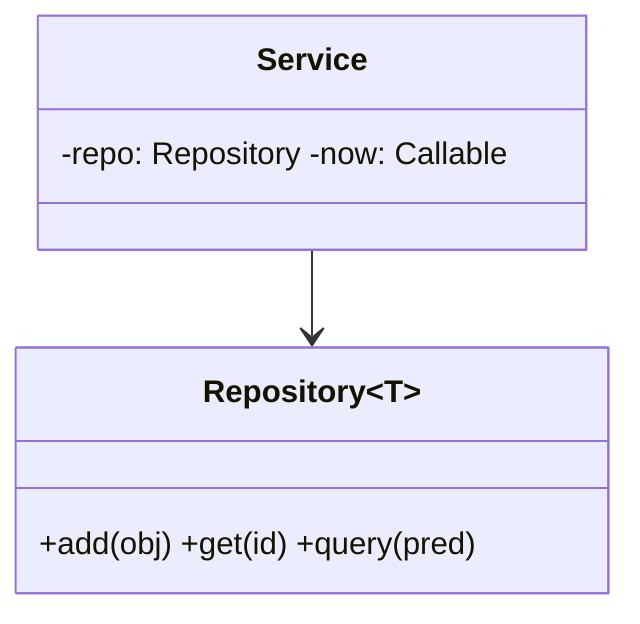

# Module 02 — Building Blocks (reusable)

> **Agent spawn**: `@Memory.md` + `@Prompt.md` + this file + `@NOTES.md`
> **Nav**: ← [01 Approach & Rubric](../01-approach-rubric/MODULE.md) · Next → [03 Clean Code & Testing](../03-clean-code-testing/MODULE.md)

## At a glance
| | |
|---|---|
| Prerequisites | 01 · LLD patterns |
| Duration | ~1–2 sessions |
| Exit test | Spin up in-memory store + clock injection + know when to lock |

## Visual map
```
In-memory Repository:   {id: obj} + indexes(by field)  → add/get/query
ID gen:                 static counter | random id
Clock injection:        service(now=callable) → testable time logic
State machine:          Enum + transition dict (or State pattern)
Concurrency:            std::mutex per resource | std::queue + condition_variable
```

**Mental model**: Machine-coding mein 80% problems wahi reusable blocks use karte: in-memory store, ID gen, clock, state machine, strategy, lock. Inko muscle-memory bana lo → time bachega. CV: tumne in-memory matching engine banaya — wahi store pattern.

**Redraw challenge**: Repository + Service-with-injected-clock diagram.

## Objectives
1. In-memory repository + indexes
2. ID gen + clock injection (testability)
3. State machine + strategy reuse
4. When/where to add concurrency

## Topics
- Dict-backed repository; secondary indexes
- ID generation; clock injection for time-based logic
- Enums for states; transition tables; Strategy reuse (from LLD)
- In-memory pub/sub; thread-safety (`std::mutex`, `std::queue`, `std::atomic`) when asked

## Assignments
| # | Task | Passing criteria |
|---|------|------------------|
| A1 | Generic in-memory `Repository` (add/get/query) | Works for 2 entity types |
| A2 | Injectable `Clock` + TTL cache using it | Expiry testable without sleeping |

## Active recall bank
1. Clock injection se test kaise easy hota?
2. Lock kahan add karoge (kab zaroori)?
3. Repository pattern kya deta?

## Progress checklist
- [ ] Building blocks ready in muscle memory
- [ ] A1, A2 coded
- [ ] NOTES.md updated
