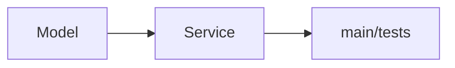

# Module 03 — Clean Code & Testing

> **Agent spawn**: `@Memory.md` + `@Prompt.md` + this file + `@NOTES.md`
> **Nav**: ← [02 Building Blocks](../02-building-blocks/MODULE.md) · Problems → [[Machine Code/problems/README|problems/]]

## At a glance
| | |
|---|---|
| Prerequisites | 01 |
| Duration | ~1 session |
| Exit test | Clean + tested + runnable under time; know over-engineering line |

## Visual map
```
LAYERS:  model (data)  →  service (logic)  →  IO/demo (main)
CLEAN:   good names, small functions, early returns, no deep nesting
TEST:    3–5 high-value asserts/unittest covering core + 1 edge
DEMO:    if __name__ == "__main__": run the happy path
```

**Mental model**: Clean code interviewer ko padhne mein aasan lage — naming + chhote functions sabse jaldi points dilate. Tests = "main confident hun" ka signal. Par time-box mein over-engineer mat karo (har cheez interface mat banao). Balance.

**Redraw challenge**: model→service→demo layering.

## Objectives
1. Readable structure + naming
2. Separation: model/service/IO
3. Minimal high-value tests (unittest)
4. Over-engineering line

## Topics
- Naming, small functions, early returns, flat nesting
- Layer separation; meaningful exceptions
- `unittest`/`pytest`; 3–5 high-value tests fast; runnable demo
- What NOT to over-engineer under time pressure

## Assignments
| # | Task | Passing criteria |
|---|------|------------------|
| A1 | Refactor a messy snippet for readability | Smaller funcs, better names, same behavior |
| A2 | Minimal `unittest` for one `problems/` solution | Core + 1 edge covered, passes |

## Active recall bank
1. Clean code mein kya sabse jaldi points deta?
2. Over-engineering line kahan?
3. 5 min mein kaunse 3 test likhoge?

## Progress checklist
- [ ] Clean + test habits internalized
- [ ] A1, A2 done
- [ ] **Machine-coding spaced-rep checklist** (LEARNING-PLAN) full pass
- [ ] NOTES.md updated
