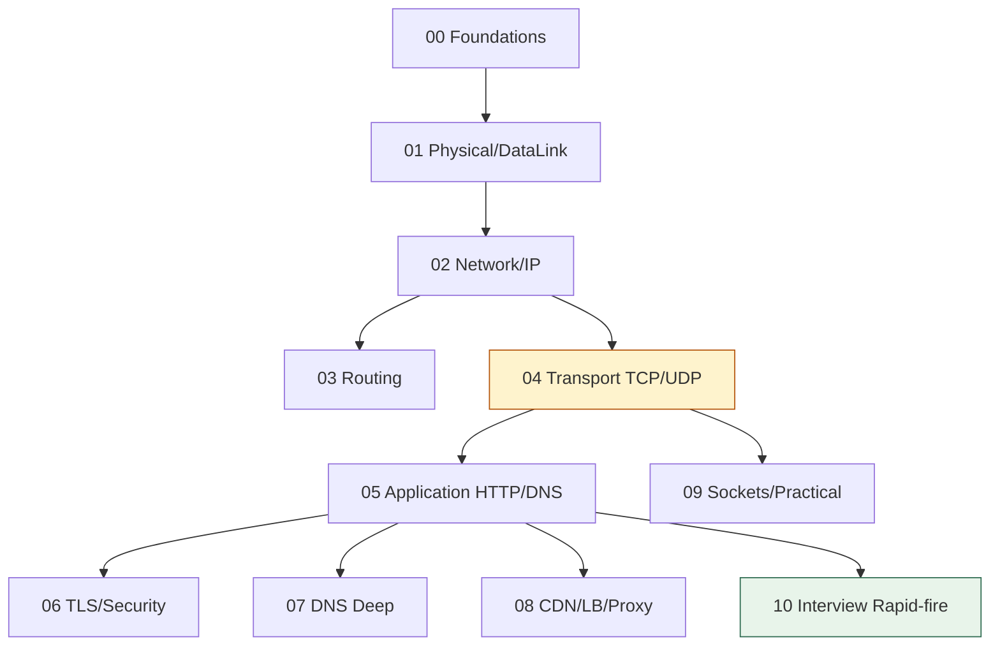

# Computer Networks — Home

> Network vault entry point. ← back to [[INTERVIEW-PREP|Master Index]]

## Quick links
| Doc | Kya hai |
|-----|---------|
| [[Network/Memory\|Memory]] | Coach rules, profile, CV→Network hooks |
| [[Network/Prompt\|Prompt]] | Hinglish coach persona |
| [[Network/LEARNING-PLAN\|LEARNING-PLAN]] | **Full syllabus** + practical tools |
| [[Network/VISUAL-STUDY-GUIDE\|VISUAL-STUDY-GUIDE]] | Master diagrams + spaced-rep |

## Modules
| # | Syllabus | Notes | Focus |
|---|----------|-------|-------|
| 00 | [[Network/modules/00-foundations/MODULE\|Foundations]] | [[Network/modules/00-foundations/NOTES\|NOTES]] | OSI vs TCP/IP, encapsulation |
| 01 | [[Network/modules/01-physical-datalink/MODULE\|Physical & Data Link]] | [[Network/modules/01-physical-datalink/NOTES\|NOTES]] | MAC, ARP, switching |
| 02 | [[Network/modules/02-network-layer-ip/MODULE\|Network Layer & IP]] | [[Network/modules/02-network-layer-ip/NOTES\|NOTES]] | IP, subnetting, NAT |
| 03 | [[Network/modules/03-routing/MODULE\|Routing]] | [[Network/modules/03-routing/NOTES\|NOTES]] | DV, LS, OSPF, BGP |
| 04 | [[Network/modules/04-transport-tcp-udp/MODULE\|Transport: TCP/UDP]] 🔥 | [[Network/modules/04-transport-tcp-udp/NOTES\|NOTES]] | Handshake, flow, congestion |
| 05 | [[Network/modules/05-application-http-dns/MODULE\|Application: HTTP & DNS]] | [[Network/modules/05-application-http-dns/NOTES\|NOTES]] | HTTP/1.1/2/3, DNS |
| 06 | [[Network/modules/06-tls-security/MODULE\|TLS & Security]] | [[Network/modules/06-tls-security/NOTES\|NOTES]] | TLS handshake, certs |
| 07 | [[Network/modules/07-dns-deepdive/MODULE\|DNS Deep Dive]] | [[Network/modules/07-dns-deepdive/NOTES\|NOTES]] | Resolution, records |
| 08 | [[Network/modules/08-cdn-lb-proxies/MODULE\|CDN, LB & Proxies]] | [[Network/modules/08-cdn-lb-proxies/NOTES\|NOTES]] | CDN, proxy, LB (→HLD) |
| 09 | [[Network/modules/09-sockets-practical/MODULE\|Sockets & Practical]] | [[Network/modules/09-sockets-practical/NOTES\|NOTES]] | Python sockets, tcpdump |
| 10 | [[Network/modules/10-interview-rapidfire/MODULE\|Interview Rapid-fire]] 🔥 | [[Network/modules/10-interview-rapidfire/NOTES\|NOTES]] | "type google.com" |

## Reading workflow
1. **Module 00 (OSI/TCP-IP) pehle** — har baat layer se map hoti
2. Har module → Visual map → topics
3. Module 09 mein Python socket khud likho; `dig`/`curl`/`tcpdump` chalao
4. Redraw challenge → `NOTES.md → My diagrams`
5. Coach: `@Memory.md @Prompt.md @modules/XX/MODULE.md`

## Dependency order


## Vault path
```
/Users/vansh/Desktop/Code/Learning/Network
```
