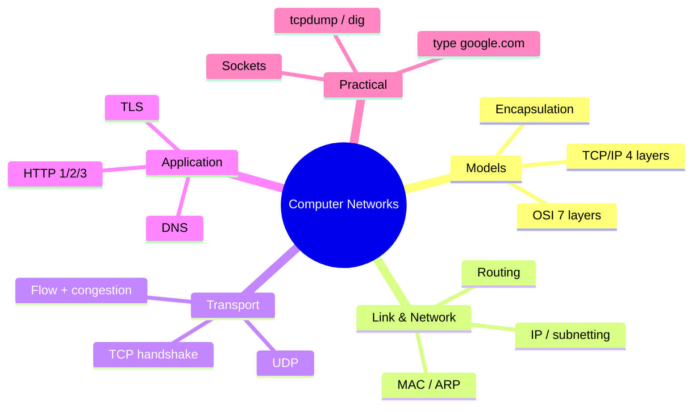
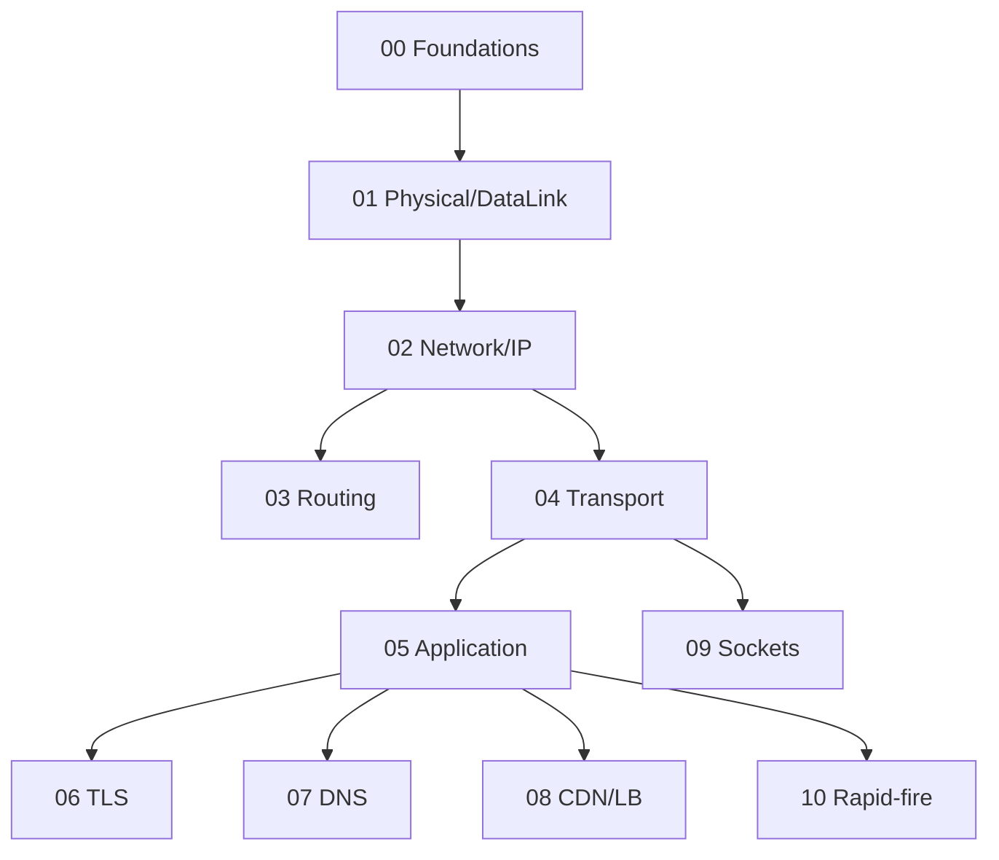

# Computer Networks — Learning Plan (Full Syllabus)

> **Visual learner**: har module `## Visual map`. Start: `@VISUAL-STUDY-GUIDE.md`.
> **No standard topic left out.** Module 04 (TCP) + 10 (rapid-fire) interview-critical.

## Mind map

## Dependency graph

---

## Module 00 — Foundations
**Topics**: Why layering; OSI 7 layers (each layer's job + PDU + example protocol); TCP/IP 4-layer model; OSI↔TCP/IP mapping; **encapsulation/decapsulation** (headers added per layer); PDUs (segment/packet/frame/bits); protocol vs service.
**Exit**: 7 OSI layers + job + example; encapsulation diagram; OSI vs TCP/IP mapping.

## Module 01 — Physical & Data Link Layer
**Topics**: Physical: signals, bandwidth, encoding (brief); Data link: framing, MAC addresses, error detection (parity, checksum, CRC); flow control (stop-and-wait, sliding window); media access (CSMA/CD, CSMA/CA); switches vs hubs; **ARP** (IP→MAC); VLANs; Ethernet frame.
**Assignments**: A1 trace ARP resolution on a LAN; A2 CRC computation by hand (small).
**Exit**: ARP flow; switch vs hub; MAC vs IP; CSMA/CD vs CA.

## Module 02 — Network Layer & IP
**Topics**: IPv4 header; IPv4 vs IPv6; classful vs classless; **subnetting + CIDR** (compute network/broadcast/host range/usable hosts); private IPs; **NAT** (PAT); DHCP; ICMP (ping/traceroute); fragmentation + MTU; default gateway.
**Assignments**: A1 subnetting drills (given CIDR → network, broadcast, hosts, ranges) ×5; A2 explain a traceroute output.
**Exit**: subnet a /24 into /26; NAT flow; public vs private IP; what ICMP does.

## Module 03 — Routing
**Topics**: Routing vs forwarding; routing table; static vs dynamic; **distance vector** (Bellman-Ford, count-to-infinity, RIP) vs **link state** (Dijkstra, OSPF); autonomous systems; **BGP** (path vector, why it runs the internet); anycast; longest-prefix match.
**Assignments**: A1 run Dijkstra on a small topology; A2 explain count-to-infinity + fix (split horizon).
**Exit**: DV vs LS; OSPF vs BGP (interior vs exterior); longest-prefix match.

## Module 04 — Transport Layer: TCP & UDP 🔥
**Topics**: Ports + sockets; **TCP 3-way handshake** + connection teardown (4-way, TIME_WAIT); reliability (seq/ack, retransmission); **flow control** (sliding window, receiver window); **congestion control** (slow start, congestion avoidance AIMD, fast retransmit/recovery, Reno/CUBIC); Nagle; head-of-line blocking; **UDP** (when, why); TCP vs UDP table.
**Assignments**: A1 draw handshake + teardown with states; A2 explain congestion window growth over time; A3 pick TCP vs UDP for 5 apps + justify.
**Exit**: 3-way handshake + states from memory; flow vs congestion control; slow start + AIMD; TCP vs UDP table; TIME_WAIT kyun.

## Module 05 — Application Layer: HTTP & DNS
**Topics**: HTTP request/response; methods (GET/POST/PUT/PATCH/DELETE), idempotency, safe methods; status codes (2xx–5xx); headers; cookies/sessions; **HTTP/1.1** (keep-alive, pipelining) vs **HTTP/2** (multiplexing, server push, HPACK) vs **HTTP/3** (QUIC over UDP, no HOL blocking); REST; WebSocket upgrade (CV hook); DNS overview; SMTP/FTP brief.
**Assignments**: A1 `curl -v` a site, annotate the exchange; A2 HTTP/1.1 vs 2 vs 3 comparison table + when each.
**Exit**: idempotent vs safe methods; status code families; HTTP/2 multiplexing vs HTTP/1.1 HOL; HTTP/3 over QUIC why.

## Module 06 — TLS & Security
**Topics**: Symmetric vs asymmetric crypto; **TLS handshake** (1.2 vs 1.3, fewer RTTs); certificates + CA chain of trust; HTTPS; what TLS provides (confidentiality, integrity, authentication); MITM; HSTS; common attacks (replay, downgrade); brief: firewalls, VPN.
**Assignments**: A1 trace TLS 1.3 handshake steps; A2 explain how a cert proves identity.
**Exit**: TLS handshake steps; symmetric vs asymmetric (where each used); cert chain of trust; TLS 1.3 vs 1.2.

## Module 07 — DNS Deep Dive
**Topics**: DNS hierarchy (root → TLD → authoritative); recursive vs iterative resolution; resolver + caching + TTL; record types (A, AAAA, CNAME, MX, NS, TXT, SOA, SRV); reverse DNS (PTR); DNS over HTTPS/TLS; anycast for DNS; DNS in load balancing (round-robin, geo).
**Assignments**: A1 `dig +trace` a domain, narrate resolution; A2 design DNS-based failover.
**Exit**: full recursive resolution path; record types; TTL caching trade-off; DNS-based LB.

## Module 08 — CDN, Load Balancing & Proxies
**Topics**: CDN (edge caching, origin, cache-control, invalidation); forward vs reverse proxy; **L4 vs L7 load balancing** (ties to HLD module 02); LB algorithms; SSL termination; sticky sessions; gateway; edge compute brief.
**Assignments**: A1 design CDN caching for static + dynamic content; A2 forward vs reverse proxy use cases.
**Exit**: forward vs reverse proxy; CDN cache-control; L4 vs L7; SSL termination where.

## Module 09 — Sockets & Practical
**Topics**: Berkeley sockets API; TCP server/client lifecycle (socket/bind/listen/accept/connect/send/recv/close); blocking vs non-blocking; `select`/`epoll` (C10k); BSD sockets (`<sys/socket.h>`); tools: `dig`, `curl`, `netstat`/`ss`, `tcpdump`/`Wireshark`, `traceroute`, `ping`, `nc`.
**Assignments (C++)**: A1 TCP echo server + client (stub + gaps); A2 concurrent server with `select`/`epoll` (handle N clients); A3 capture + read a `tcpdump` of a handshake.
**Exit**: socket lifecycle; blocking vs non-blocking; C10k + epoll; read a packet capture.

## Module 10 — Interview Rapid-fire 🔥
**Topics**: **"What happens when you type google.com and press enter"** (full path: cache→DNS→ARP→TCP→TLS→HTTP→render); TCP vs UDP; 3-way handshake; HTTP vs HTTPS; HTTP/2 vs 3; status codes; how DNS works; what is a socket; L4 vs L7; how does ping work; congestion vs flow control; head-of-line blocking; cookies vs sessions vs tokens.
**Assignments**: A1 write the full "type google.com" answer end-to-end; A2 10 rapid-fire Q answered crisply.
**Exit**: deliver the google.com walk-through fluently; 12 rapid-fire confidently.

---

## Weekly rhythm
| Day | Focus |
|-----|-------|
| Mon–Tue | Concept + recall |
| Wed–Thu | Socket/tool assignment |
| Fri | Rapid-fire drills + NOTES |
| Sat | Spaced recall (OSI, TCP, DNS) |
| Sun | Buffer |

## Spaced repetition checklist (har 2 modules)
- [ ] OSI 7 layers + PDUs
- [ ] TCP 3-way handshake + states
- [ ] Flow vs congestion control
- [ ] DNS recursive resolution path
- [ ] HTTP/1.1 vs 2 vs 3
- [ ] TLS handshake
- [ ] "type google.com" full path
