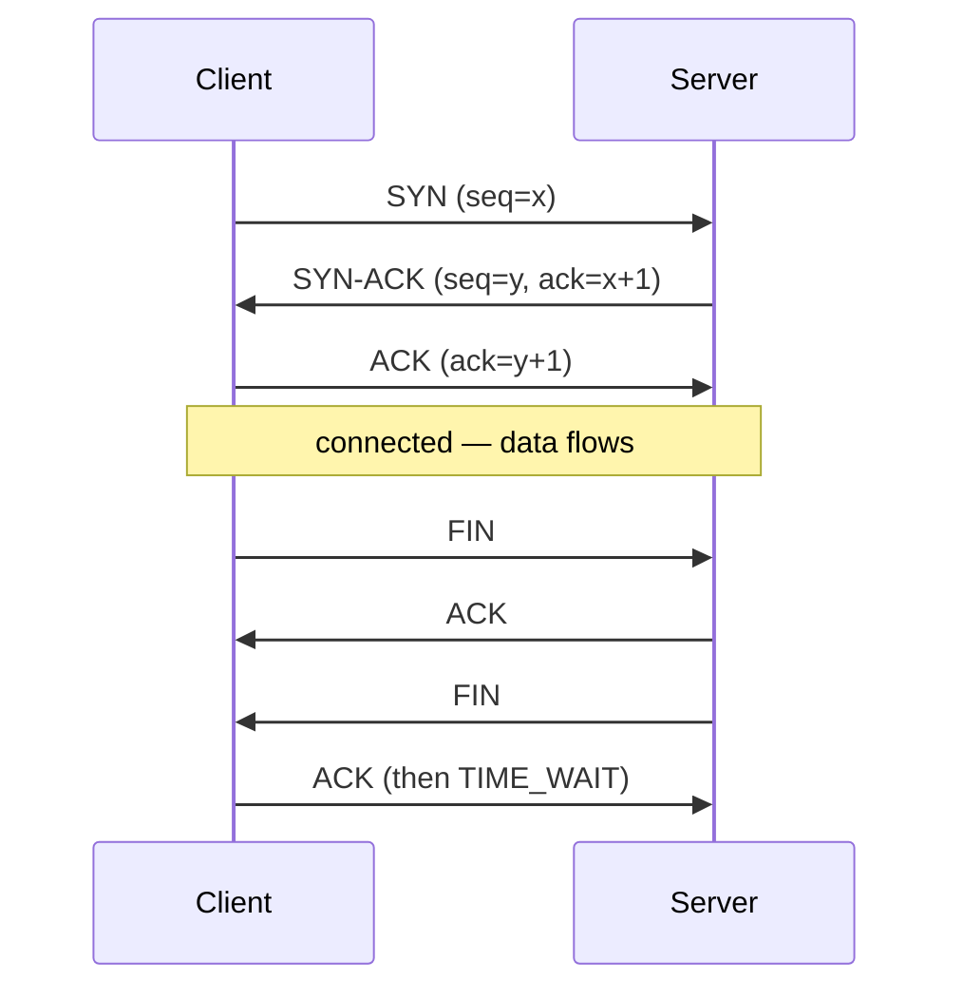

# Networks Visual Study Guide — Vansh

> Visual learner master sheet. Layered/packet diagrams pehle, redraw se recall.

## OSI vs TCP/IP (MEMORIZE)
```
OSI (7)            TCP/IP (4)     PDU        Example
7 Application  ┐
6 Presentation ├─ Application     data       HTTP, DNS, TLS
5 Session      ┘
4 Transport       Transport       segment    TCP, UDP
3 Network         Internet        packet     IP, ICMP
2 Data Link    ┐  Network Access  frame       Ethernet, ARP
1 Physical     ┘                  bits        cables, radio
```

## Encapsulation
```
[ App data ]
[ TCP hdr | App data ]                 segment
[ IP hdr | TCP hdr | App data ]        packet
[ Eth hdr | IP hdr | TCP hdr | data | Eth trailer ]  frame → bits
```

## TCP 3-way handshake + teardown


## Congestion control
```
cwnd
 │        /\  fast recovery
 │       /  \____
 │      /        AIMD (congestion avoidance, linear +1)
 │   __/  slow start (exponential x2)
 └────────────────► time   (loss → cut window)
```

## "Type google.com" full path
```
1 browser cache / OS cache / hosts file
2 DNS: resolver → root → TLD → authoritative  (UDP 53)
3 ARP: IP → MAC (local)
4 TCP 3-way handshake (port 443)
5 TLS handshake (cert verify, keys)
6 HTTP GET / → server
7 response → render (HTML/CSS/JS)
```

## TCP vs UDP
```
TCP: connection, reliable, ordered, flow+congestion ctrl, heavier  (web, APIs, files)
UDP: connectionless, best-effort, fast, no ordering              (DNS, video, games, QUIC)
```

## CV → Network bridge
```
WebSockets (matching engine) ──► TCP, full-duplex, upgrade
Redis pub-sub                ──► application-layer messaging
HTTP REST APIs               ──► methods, status, headers
Load balancer (prod)         ──► L4 vs L7, reverse proxy
HTTPS on APIs                ──► TLS handshake, certs
```

## Spaced-rep recall bank
1. OSI 7 layers + PDU each?
2. 3-way handshake + TIME_WAIT kyun?
3. Flow vs congestion control?
4. DNS recursive path?
5. HTTP/2 vs HTTP/3 HOL blocking?
6. TLS kya 3 cheezein deta?
7. TCP vs UDP — 3 apps each?
