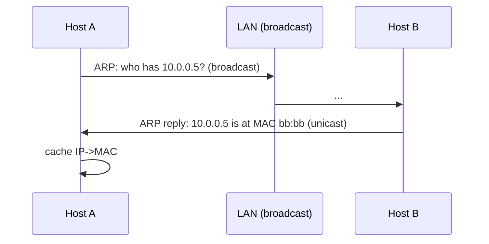

# Module 01 — Physical & Data Link Layer

> **Agent spawn**: `@Memory.md` + `@Prompt.md` + this file + `@NOTES.md`
> **Nav**: ← [00 Foundations](../00-foundations/MODULE.md) · Next → [02 Network Layer & IP](../02-network-layer-ip/MODULE.md)

## At a glance
| | |
|---|---|
| Prerequisites | 00 |
| Duration | ~1 session |
| Exit test | ARP flow + switch vs hub + MAC vs IP |

## Visual map

```
MAC = hardware address (layer 2, local)   |  IP = logical (layer 3, global)
Switch = learns MACs, forwards to one port |  Hub = dumb, floods all
Error detect: parity < checksum < CRC
```
**Mental model**: Data link layer = same LAN pe frame deliver karna (MAC se). ARP = "IP toh pata hai, MAC kaun sa?" — broadcast pooch kar. Switch MAC table seekhta, hub sab ko bhejta.

**Redraw challenge**: ARP request/reply sequence.

## Objectives
1. Framing, MAC, error detection
2. Flow control + media access (CSMA/CD vs CA)
3. ARP (IP→MAC)
4. Switch vs hub; Ethernet frame

## Topics
- Physical layer brief (signals, bandwidth, encoding)
- Framing; MAC addresses; Ethernet frame
- Error detection: parity, checksum, CRC
- Flow control: stop-and-wait, sliding window
- Media access: CSMA/CD (wired), CSMA/CA (wireless)
- ARP; switches vs hubs; VLAN brief

## Assignments
| # | Task | Passing criteria |
|---|------|------------------|
| A1 | Trace ARP resolution step-by-step on a LAN | Broadcast→reply→cache correct |
| A2 | Small CRC computation by hand | Correct remainder |

## Active recall bank
1. ARP kya solve karta?
2. Switch hub se kaise alag?
3. CSMA/CD vs CSMA/CA — wired vs wireless kyun?

## Progress checklist
- [ ] ARP flow from memory
- [ ] A1, A2 done
- [ ] NOTES.md updated
