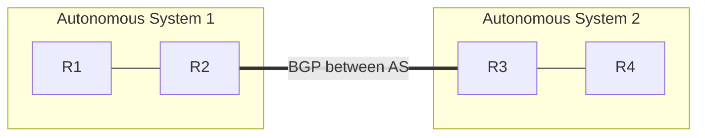

# Module 03 — Routing

> **Agent spawn**: `@Memory.md` + `@Prompt.md` + this file + `@NOTES.md`
> **Nav**: ← [02 Network Layer & IP](../02-network-layer-ip/MODULE.md) · Next → [04 Transport TCP/UDP](../04-transport-tcp-udp/MODULE.md)

## At a glance
| | |
|---|---|
| Prerequisites | 02 |
| Duration | ~1 session |
| Exit test | DV vs LS + OSPF vs BGP + longest-prefix match |

## Visual map

```
Distance Vector (RIP): "padosi se sun, hop count" — count-to-infinity issue
Link State (OSPF):     "poora map banao, Dijkstra chalao"
BGP: path-vector, between autonomous systems — internet ka backbone
Forwarding: longest-prefix match
```
**Mental model**: Routing = best path nikalna; forwarding = ek packet ko agle hop pe bhejna. DV = gossip with neighbors (simple, slow converge); LS = everyone knows full topology (fast, more memory). BGP = AS-to-AS, policy-driven.

**Redraw challenge**: DV vs LS comparison + AS/BGP boundary.

## Objectives
1. Routing vs forwarding; routing table
2. Distance vector vs link state
3. OSPF vs BGP (interior vs exterior)
4. Longest-prefix match; anycast

## Topics
- Routing vs forwarding; static vs dynamic
- Distance vector (Bellman-Ford, count-to-infinity, split horizon, RIP)
- Link state (Dijkstra, OSPF)
- Autonomous systems; BGP (path vector, policy)
- Longest-prefix match; anycast

## Assignments
| # | Task | Passing criteria |
|---|------|------------------|
| A1 | Run Dijkstra on a small weighted topology | Correct shortest paths |
| A2 | Explain count-to-infinity + split horizon fix | Clear example |

## Active recall bank
1. DV vs LS — convergence + memory trade-off?
2. OSPF vs BGP — interior vs exterior?
3. Longest-prefix match kyun?

## Progress checklist
- [ ] DV vs LS + BGP from memory
- [ ] A1, A2 done
- [ ] NOTES.md updated
