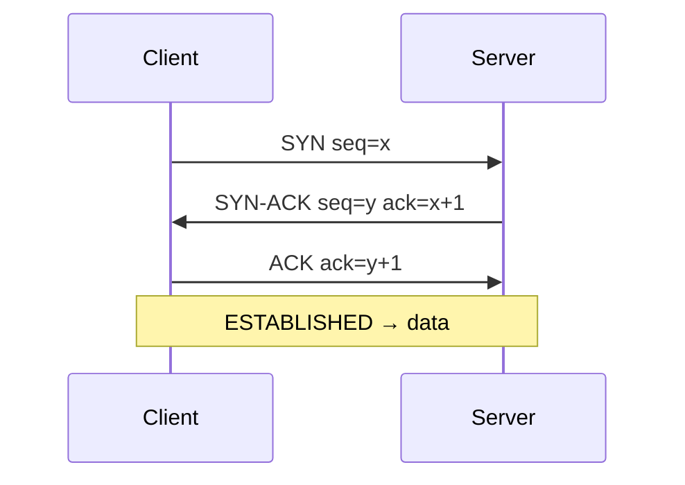

# Module 04 — Transport Layer: TCP & UDP 🔥

> **Agent spawn**: `@Memory.md` + `@Prompt.md` + this file + `@NOTES.md`
> **Nav**: ← [03 Routing](../03-routing/MODULE.md) · Next → [05 Application HTTP/DNS](../05-application-http-dns/MODULE.md)

## At a glance
| | |
|---|---|
| Prerequisites | 02 |
| Duration | ~2 sessions |
| Exit test | Handshake + states + flow vs congestion + TCP/UDP table |

## Visual map

```
Flow control     : receiver window — "mujhe itna hi bhejo" (receiver bachao)
Congestion ctrl  : network ko bachao — slow start (x2) → AIMD (+1) → loss → cut
TIME_WAIT        : last ACK lost ho toh resend, duplicate purge (2*MSL)
TCP: reliable/ordered/heavy | UDP: fast/best-effort/light
```
**Mental model**: TCP = reliable ordered byte-stream (handshake, ack, retransmit). Flow control = receiver ko overwhelm na karo; congestion control = network ko overwhelm na karo — do alag cheezein. UDP = "bhej do, tension nahi" (DNS, video, QUIC).

**Redraw challenge**: 3-way handshake + 4-way teardown with states + congestion window graph.

## Objectives
1. Ports/sockets; handshake + teardown + states
2. Reliability (seq/ack, retransmit)
3. Flow control vs congestion control
4. UDP; TCP vs UDP decision

## Topics
- Ports + sockets; TCP 3-way handshake; 4-way teardown; TIME_WAIT
- Reliability: sequence/ack, retransmission, RTO
- Flow control: sliding window, receiver window
- Congestion control: slow start, AIMD, fast retransmit/recovery, Reno/CUBIC
- Nagle; head-of-line blocking; UDP; TCP vs UDP table

## Assignments
| # | Task | Passing criteria |
|---|------|------------------|
| A1 | Draw handshake + teardown with TCP states | All states labeled correctly |
| A2 | Explain congestion window over time (graph) | Slow start + AIMD + loss shown |
| A3 | TCP vs UDP for 5 apps + justify | Each correct + reasoned |

## Active recall bank
1. 3-way handshake — why 3 not 2?
2. Flow vs congestion control difference?
3. TIME_WAIT kyun hota?
4. UDP kab better than TCP?

## Progress checklist
- [ ] Handshake + states + congestion from memory
- [ ] A1–A3 done
- [ ] NOTES.md updated
